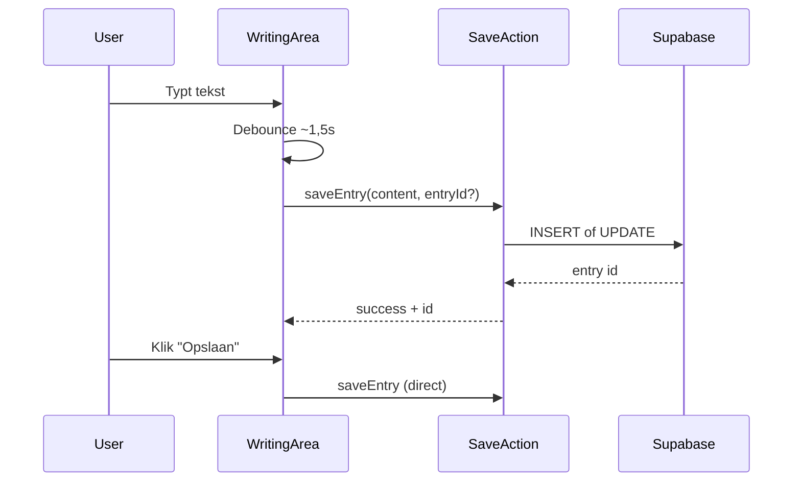

# Entry opslaan in de database

## Huidige situatie

Na registratie en onboarding landt de gebruiker op [`/schrijf?prompt=first_entry`](app/(app)/schrijf/page.tsx). [`WritingArea`](components/journal/WritingArea.tsx) houdt tekst alleen in lokale React state bij; er is geen persistence.

De database is **al klaar**:

```17:23:supabase/migrations/20250615000000_initial_schema.sql
CREATE TABLE public.entries (
    id uuid PRIMARY KEY DEFAULT gen_random_uuid(),
    user_id uuid NOT NULL REFERENCES auth.users (id) ON DELETE CASCADE,
    content text NOT NULL,
    summary text,
    created_at timestamptz NOT NULL DEFAULT now()
);
```

RLS staat INSERT/UPDATE/DELETE toe voor eigen entries (`auth.uid() = user_id`). Types bestaan in [`lib/types/database.ts`](lib/types/database.ts).



## Architectuurkeuze

**Server action** (nieuw patroon in dit project) i.p.v. directe client-side Supabase calls:

- Auth-check server-side via [`lib/supabase/server.ts`](lib/supabase/server.ts)
- Centrale validatie en Nederlandse foutmeldingen
- `revalidatePath` voor latere dashboard/entries-pagina's
- RLS blijft extra beveiligingslaag

**Insert-then-update patroon:** bij eerste save (auto of handmatig) een `INSERT`; daarna `UPDATE` op hetzelfde `entryId` dat in component-state wordt bijgehouden.

## Bestanden

| Actie | Bestand |
|-------|---------|
| Nieuw | `lib/entries/save-entry.ts` — server action + validatie |
| Nieuw | `lib/entries/delete-entry.ts` — server action voor verwijderen |
| Nieuw | `lib/entries/errors.ts` — Nederlandse foutteksten |
| Wijzig | [`components/journal/WritingArea.tsx`](components/journal/WritingArea.tsx) — save-state, debounce, feedback |
| Wijzig | [`components/journal/WritingToolbar.tsx`](components/journal/WritingToolbar.tsx) — opslaan-knop in main panel |
| Wijzig | [`app/(app)/schrijf/page.tsx`](app/(app)/schrijf/page.tsx) — optioneel `promptType` doorgeven (voor toekomstige first-entry UX) |

Geen schema-migratie nodig. Bookmark, privé en afbeeldingen vallen **buiten scope** (geen kolommen in `entries`).

## 1. Server actions

### `saveEntry(content: string, entryId?: string)`

```typescript
"use server"
// lib/entries/save-entry.ts
```

- Haal user op via `createClient()` + `getUser()`; geen user → `"Je bent niet ingelogd."`
- Trim `content`; leeg → `{ error: "Schrijf iets voordat je opslaat." }` (geen DB-call)
- **INSERT** als geen `entryId`: `{ user_id: user.id, content }`
- **UPDATE** als wel `entryId`: `{ content }` (RLS garandeert eigenaarschap)
- Bij Supabase-fout: generieke NL-melding via `getEntryErrorMessage()`
- Succes: `{ id: string }`
- `revalidatePath('/entries')` en `revalidatePath('/vandaag')`

### `deleteEntry(entryId: string)`

- DELETE op `entries` waar `id = entryId`
- Gebruikt wanneer gebruiker "Entry verwijderen" kiest **en** er al een opgeslagen entry is

## 2. WritingArea — save-logica

State uitbreiden:

```typescript
const [entryId, setEntryId] = useState<string | null>(null);
const [saveStatus, setSaveStatus] = useState<"idle" | "saving" | "saved" | "error">("idle");
const [saveError, setSaveError] = useState<string | null>(null);
```

**Gedeelde save-functie** `persistEntry(content: string)`:
- Zet status op `"saving"`
- Roept `saveEntry(content, entryId ?? undefined)` aan
- Bij succes: `setEntryId(result.id)`, status `"saved"`, reset naar `"idle"` na ~2s
- Bij fout: status `"error"`, toon `saveError`

**Auto-save (debounced):**
- `useEffect` of kleine `useDebouncedCallback` (~1500ms) op `content`
- Alleen triggeren als `content.trim().length > 0`
- Niet opnieuw save'en als content ongewijzigd sinds laatste succesvolle save (ref bijhouden)

**Handmatig opslaan:**
- Nieuwe prop `onSave` naar toolbar
- Direct `persistEntry` aanroepen (zonder debounce-wacht)

**Verwijderen:**
- Als `entryId` bestaat → `deleteEntry(entryId)` + lokale state reset
- Anders → alleen lokale state reset (huidig gedrag)

**Feedback (kalme UX, geen toast-library):**
- Subtiele statusregel onder hint, `aria-live="polite"`:
  - `"Opslaan…"` / `"Opgeslagen"` / foutmelding in NL
- Geen modal of blocking UI

## 3. Toolbar — opslaan-knop

In het **main panel** van [`WritingToolbar`](components/journal/WritingToolbar.tsx), naast bestaande iconen:

- Nieuwe prop: `onSave: () => void` + `isSaving?: boolean`
- Knop met label `"Opslaan"`, disabled als content leeg of `isSaving`
- Visueel consistent met bestaande `ToolbarIconButton` (lumina-kleuren)

## 4. Schrijfpagina

[`app/(app)/schrijf/page.tsx`](app/(app)/schrijf/page.tsx) blijft dun. Optioneel `promptType` doorgeven aan `WritingArea` als prop voor latere first-entry-specifieke feedback (bijv. "Je eerste entry is opgeslagen") — **niet verplicht voor MVP**.

## Buiten scope (opvolgstappen)

Deze items zijn **niet** nodig om de eerste entry op te slaan, maar wel logische vervolgstappen:

- [`app/(app)/entries/page.tsx`](app/(app)/entries/page.tsx) — entries ophalen en tonen i.p.v. placeholder
- [`lib/mock/dashboard.ts`](lib/mock/dashboard.ts) — vervangen door echte entry-count query
- Onboarding-antwoorden naar `profiles.ai_persona_preference` schrijven
- `summary` / `emotion_analyses` (AI-fase)

## Testplan

1. **Registratie-flow:** account aanmaken → onboarding → `/schrijf?prompt=first_entry` → tekst typen → auto-save triggert → status "Opgeslagen"
2. **Handmatig opslaan:** knop "Opslaan" werkt direct, ook vóór debounce afloopt
3. **Persistie:** pagina verversen → entry is in Supabase (Dashboard of `db:verify`); UI toont nog geen opgeslagen content terug (bewust buiten scope tenzij gewenst)
4. **Update:** verder typen na eerste save → UPDATE op zelfde row (geen dubbele entries)
5. **Verwijderen:** na save → "Entry verwijderen" → row weg uit DB
6. **Auth:** uitgelogde gebruiker op `/schrijf` → middleware redirect naar `/inloggen`
7. **Lege save:** opslaan-knop disabled / geen auto-save bij lege content

## Status

- [x] Plan opgeslagen in `.cursor/plans/entry-opslaan-database.md`
- [ ] Server actions geïmplementeerd
- [ ] WritingArea save-logica geïmplementeerd
- [ ] Toolbar opslaan-knop geïmplementeerd
- [ ] Save-feedback geïmplementeerd
- [ ] Handmatig getest
