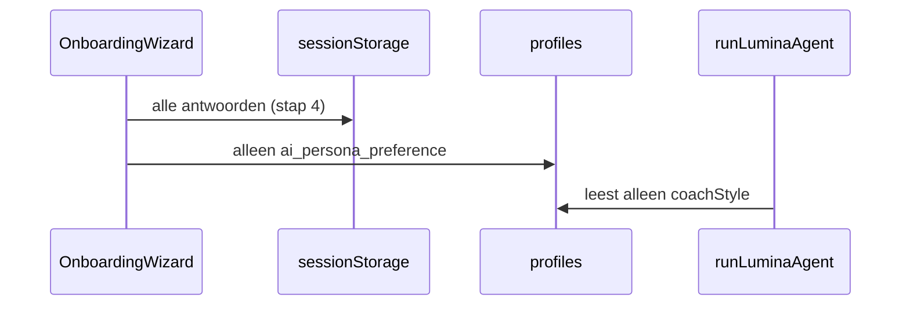
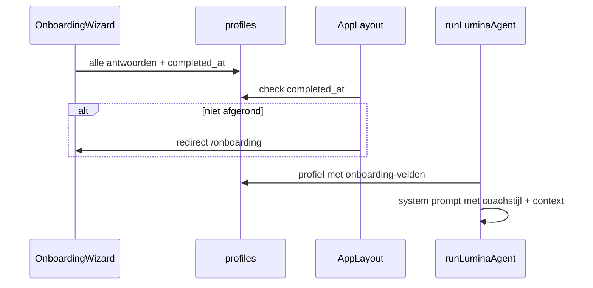

# Fase 1: Onboarding volledig koppelen aan personalisatie

Onderdeel van het overkoepelende plan: [vier-kernfeatures-afmaken.md](./vier-kernfeatures-afmaken.md)

## Doel

Alle vier onboarding-stappen worden opgeslagen in `profiles` en gebruikt in AI-interacties (toolbar op `/schrijf` en "Vraag het Lumina" op `/vandaag`). Gebruikers die de wizard overslaan, worden bij de volgende app-bezoek doorgestuurd naar `/onboarding`.

## Huidige situatie



**Betrokken bestanden:**

- Wizard: [`components/onboarding/OnboardingWizard.tsx`](../../components/onboarding/OnboardingWizard.tsx) — roept `completeOnboarding(coachStyle)` aan
- Opslag: [`lib/profile/complete-onboarding.ts`](../../lib/profile/complete-onboarding.ts) — 1 veld
- AI: [`lib/ai/agent-prompt.ts`](../../lib/ai/agent-prompt.ts), [`lib/ai/agent.ts`](../../lib/ai/agent.ts)
- Aanroepers: [`lib/ai/respond-to-entry.ts`](../../lib/ai/respond-to-entry.ts), [`lib/ai/ask-lumina.ts`](../../lib/ai/ask-lumina.ts)
- Profiel: [`lib/types/database.ts`](../../lib/types/database.ts) `Profile` — mist onboarding-velden

**Twee onboarding-paden** (beide moeten blijven werken):

1. Registratie-overlay: [`RegisterOverlay.tsx`](../../components/marketing/RegisterOverlay.tsx) → compact wizard → `/schrijf`
2. Standalone route: [`app/(onboarding)/onboarding/page.tsx`](../../app/(onboarding)/onboarding/page.tsx)

---

## Stap 1 — Database-migratie

Nieuw bestand: `supabase/migrations/20250622150000_profile_onboarding.sql`

```sql
ALTER TABLE public.profiles
  ADD COLUMN onboarding_main_goal text,
  ADD COLUMN onboarding_priorities jsonb NOT NULL DEFAULT '[]'::jsonb,
  ADD COLUMN onboarding_experience text,
  ADD COLUMN onboarding_completed_at timestamptz;

-- Bestaande gebruikers met coachstijl: beschouw als afgerond
UPDATE public.profiles
SET onboarding_completed_at = updated_at
WHERE ai_persona_preference IS NOT NULL
  AND onboarding_completed_at IS NULL;
```

**Types bijwerken** in [`lib/types/database.ts`](../../lib/types/database.ts):

```ts
export interface Profile {
  // bestaand...
  onboarding_main_goal: OnboardingMainGoal | null;
  onboarding_priorities: OnboardingPriority[];
  onboarding_experience: JournalExperience | null;
  onboarding_completed_at: string | null;
}
```

Import onboarding-types uit [`lib/types/onboarding.ts`](../../lib/types/onboarding.ts).

**Script:** `npm run db:migrate` uitvoeren na toevoegen migratie.

---

## Stap 2 — Onboarding opslaan (server action)

**Wijzig** [`lib/profile/complete-onboarding.ts`](../../lib/profile/complete-onboarding.ts):

- Signatuur: `completeOnboarding(answers: OnboardingAnswers)` i.p.v. alleen `coachStyle`
- Validatie server-side:
  - `mainGoal`, `experience`, `coachStyle` verplicht
  - `priorities.length >= 1`
- Update alle velden + `onboarding_completed_at: new Date().toISOString()`
- `revalidatePath` voor `/vandaag`, `/instellingen`, `/schrijf`

**Wijzig** [`components/onboarding/OnboardingWizard.tsx`](../../components/onboarding/OnboardingWizard.tsx):

- Roep `completeOnboarding(finalAnswers)` aan
- Voeg `isSaving` + foutmelding toe (nu geen error/loading state bij stap 4)
- Bij succes: redirect naar `/schrijf?prompt=first_entry` (ongewijzigd)
- `sessionStorage`-opslag van antwoorden mag blijven als fallback tijdens de wizard, maar is niet meer de bron van waarheid voor AI

---

## Stap 3 — Onboarding-context voor AI

**Nieuw** `lib/profile/onboarding-context.ts`:

| Export | Doel |
|--------|------|
| `isOnboardingComplete(profile)` | `onboarding_completed_at != null` |
| `buildOnboardingPromptContext(profile)` | Korte NL-tekst voor system prompt |

`buildOnboardingPromptContext` mapt ids naar labels via bestaande constanten in [`lib/constants/onboarding.ts`](../../lib/constants/onboarding.ts):

```ts
// Voorbeeld output (1 compact blok, ~3-5 regels):
// GEBRUIKERSCONTEXT (onboarding):
// Hoofddoel: Mental Health verbeteren
// Prioriteiten: Relaties, Gezondheid en welzijn
// Journalervaring: Dit is de eerste keer
```

Geen ids in de prompt — alleen Nederlandse labels.

**Wijzig** [`lib/ai/agent-prompt.ts`](../../lib/ai/agent-prompt.ts):

- Breid `BuildSystemPromptInput` uit met optioneel `onboardingContext?: string`
- Voeg blok toe na `COACH_STYLE_PROMPTS`, vóór interaction mode:

```ts
if (input.onboardingContext) {
  parts.push(input.onboardingContext);
}
```

**Wijzig** [`lib/ai/agent.ts`](../../lib/ai/agent.ts):

- Voeg `onboardingContext?: string` toe aan `AgentInput`
- Geef door aan `buildSystemPrompt`

**Wijzig aanroepers** — beide laden profiel en bouwen context:

- [`lib/ai/respond-to-entry.ts`](../../lib/ai/respond-to-entry.ts) — heeft `getProfile()` al
- [`lib/ai/ask-lumina.ts`](../../lib/ai/ask-lumina.ts) — heeft `getProfile()` al

```ts
const onboardingContext = buildOnboardingPromptContext(profile);
// ...
runLuminaAgent({ ..., onboardingContext });
```

**Buiten scope fase 1:** [`lib/ai/analyze-entry.ts`](../../lib/ai/analyze-entry.ts) gebruikt een eigen prompt bij opslaan — personalisatie daar is optionele vervolgstap, niet nodig om fase 1 af te ronden.

---

## Stap 4 — Onboarding afdwingen

**Aanpak:** redirect in app-layout (niet middleware) — voorkomt extra DB-query op elke request en past bij bestaande `getProfile()`-patroon.

**Wijzig** [`app/(app)/layout.tsx`](../../app/(app)/layout.tsx) naar async server component:

```tsx
export default async function AppLayout({ children }) {
  const profile = await getProfile();

  if (!isOnboardingComplete(profile)) {
    redirect("/onboarding");
  }

  return (/* bestaande JSX */);
}
```

**Waarom layout i.p.v. middleware:**

- [`middleware.ts`](../../middleware.ts) heeft nu geen profiel-query
- Onboarding-route [`app/(onboarding)/`](../../app/(onboarding)/) zit **buiten** `(app)` — geen redirect-loop
- Publieke routes (`/`, `/inloggen`) blijven ongewijzigd

**Edge cases:**

| Scenario | Gedrag |
|----------|--------|
| Nieuwe user na registratie-overlay | `completeOnboarding` zet `completed_at` vóór redirect naar `/schrijf` |
| Bestaande user zonder onboarding | Redirect naar `/onboarding` bij elk app-bezoek |
| User met `ai_persona_preference` (backfill) | Migratie zet `completed_at` — geen geforceerde her-onboarding |
| User op `/onboarding` | Layout van `(onboarding)` — geen check |

---

## Stap 5 — Verificatie & testplan

**Handmatige tests:**

1. **Nieuwe registratie** — doorloop 4 stappen → controleer in Supabase dat alle 4 profile-velden + `onboarding_completed_at` gevuld zijn
2. **AI-personalisatie** — stel op `/vandaag` een vraag; controleer (via logging in dev of inspectie van prompt) dat hoofddoel/prioriteiten in system prompt staan
3. **Toolbar** — op `/schrijf` klik "Coach me"; antwoord moet aansluiten bij gekozen coachstijl én onboarding-context
4. **Skip-test** — simuleer user zonder `onboarding_completed_at` (null in DB) → bezoek `/vandaag` → redirect naar `/onboarding`
5. **Bestaande user** — user met alleen `ai_persona_preference` (pre-migratie) → geen redirect, app werkt normaal

**Geen UI-wijzigingen nodig** in Instellingen — coachstijl blijft bewerkbaar via [`ProfileForm.tsx`](../../components/settings/ProfileForm.tsx). Hoofddoel/prioriteiten bewerken in instellingen is buiten scope fase 1.

---

## Bestandenoverzicht

| Actie | Bestand |
|-------|---------|
| Nieuw | `supabase/migrations/20250622150000_profile_onboarding.sql` |
| Nieuw | `lib/profile/onboarding-context.ts` |
| Wijzig | `lib/types/database.ts` |
| Wijzig | `lib/profile/complete-onboarding.ts` |
| Wijzig | `components/onboarding/OnboardingWizard.tsx` |
| Wijzig | `lib/ai/agent-prompt.ts` |
| Wijzig | `lib/ai/agent.ts` |
| Wijzig | `lib/ai/respond-to-entry.ts` |
| Wijzig | `lib/ai/ask-lumina.ts` |
| Wijzig | `app/(app)/layout.tsx` |

**Totaal:** 2 nieuwe + 8 gewijzigde bestanden, 1 migratie.

---

## Gewenste eindtoestand


