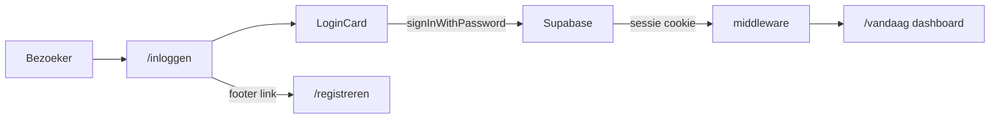

# Loginpagina Lumina

## Overzicht

Bouw een rustige loginpagina op `/inloggen` die visueel aansluit bij RegisterCard, Supabase e-mail/wachtwoord-login gebruikt, en na succes doorstuurt naar het dashboard (`/vandaag`). Werk middleware en bestaande links bij voor consistente routing.

## Todos

- [ ] Maak `components/auth/LoginCard.tsx` met UI + Supabase signInWithPassword
- [ ] Maak `app/inloggen/page.tsx` met gecentreerde auth-shell
- [ ] Breid `Input` uit met optionele `labelAction` prop voor wachtwoord-link
- [ ] Werk middleware bij: `/inloggen`, publieke routes, ingelogde redirect
- [ ] Update Header, auth callback, FooterGate; voeg wachtwoord-vergeten stub toe

## Context

De auth-basis staat al klaar:
- Supabase clients in [`lib/supabase/client.ts`](../../lib/supabase/client.ts) en [`lib/supabase/server.ts`](../../lib/supabase/server.ts)
- Middleware in [`middleware.ts`](../../middleware.ts) stuurt niet-ingelogde gebruikers door (nu nog naar `/login`)
- [`components/marketing/RegisterCard.tsx`](../../components/marketing/RegisterCard.tsx) is het visuele referentiemodel (logo, kaart, formulier, footer-link)
- Dashboard = [`app/(app)/vandaag/page.tsx`](../../app/(app)/vandaag/page.tsx)

**Bekende inconsistenties die we meenemen:**

| Plek | Huidig | Nieuw |
|------|--------|-------|
| Middleware redirect | `/login` | `/inloggen` |
| RegisterCard link | `/inloggen` | blijft |
| Marketing Header "Inloggen" | `/vandaag` | `/inloggen` |
| Auth callback | `/dashboard` (bestaat niet) | `/vandaag` |

## Architectuur



## Visueel ontwerp (aangepast aan Lumina tokens)

Jouw specificatie wordt vertaald naar het bestaande design system ([`tailwind-styling.mdc`](../rules/tailwind-styling.mdc)): geen `slate`/`zinc`/`teal`-klassen, maar semantische Lumina-tokens die hetzelfde rustige effect geven.

| Jouw specificatie | Lumina-implementatie |
|-------------------|----------------------|
| `bg-slate-50 dark:bg-zinc-950` | `bg-background` (past zich aan via `prefers-color-scheme`) |
| Witte kaart `rounded-2xl` + schaduw | `bg-surface rounded-2xl border border-lumina-500/25 shadow-lg` (zoals RegisterCard) |
| Dunne rand, mint focus | bestaande `Input`-styling: `border-lumina-500/25 focus:border-lumina-500 focus:ring-lumina-100/50` |
| Teal knop `bg-teal-600` | `bg-lumina-500 hover:bg-lumina-700 text-surface` (breed, `w-full`) |
| "Wachtwoord vergeten?" link | `text-lumina-500 hover:text-lumina-700` naast het wachtwoordlabel |

**Pagina-layout:** gecentreerde full-height shell (vergelijkbaar met [`app/(marketing)/layout.tsx`](../../app/(marketing)/layout.tsx) `marketing-aura`), zonder AppHeader. Footer verbergen op `/inloggen` via [`FooterGate`](../../components/layout/FooterGate.tsx) — net als onboarding, voor een rustige focus.

## Bestanden

### 1. `components/auth/LoginCard.tsx` (nieuw, client component)

Spiegelt de structuur van `RegisterCard`:

- **Header:** gecentreerd `Logo` (`opacity-70`, `h-6 w-6`), titel "Welkom terug" (`font-serif text-2xl`), subtekst "Neem een moment voor jezelf." (`text-muted text-sm`)
- **Formulier:**
  - E-mail: bestaande `Input` component
  - Wachtwoord: labelrij met rechts de link "Wachtwoord vergeten?" → `/wachtwoord-vergeten` (stub-route; geen volledige reset-flow in deze fase)
  - Foutmelding bij mislukte login (bijv. "E-mailadres of wachtwoord is onjuist.")
  - Submit-knop: `Inloggen ✦`, `disabled` tijdens laden
- **Footer onder de kaart:** "Nieuw bij Lumina? Registreer hier" → `/registreren`

**Auth-logica:**

```tsx
const supabase = createClient()
const { error } = await supabase.auth.signInWithPassword({ email, password })
if (!error) router.push("/vandaag")
```

### 2. `app/inloggen/page.tsx` (nieuw)

Dunne server page die alleen de shell + `LoginCard` composeert:

```tsx
<main className="marketing-aura flex flex-1 items-center justify-center px-4 py-12">
  <div className="w-full max-w-md">
    <LoginCard />
  </div>
</main>
```

### 3. `components/ui/Input.tsx` — kleine uitbreiding

Voeg optionele prop `labelAction?: React.ReactNode` toe voor de wachtwoordrij (label links, link rechts in een `flex justify-between` header). Geen apart password-component nodig.

### 4. Middleware-aanpassingen — [`middleware.ts`](../../middleware.ts)

- Redirect niet-ingelogde gebruikers naar `/inloggen` (niet `/login`)
- Publieke routes toestaan zonder sessie:
  - `/` (marketing)
  - `/registreren`
  - `/inloggen`
  - `/auth/*`
  - `/wachtwoord-vergeten` (stub)
- Ingelogde gebruikers die `/inloggen` bezoeken → redirect naar `/vandaag`
- Matcher bijwerken: `inloggen` i.p.v. `login` uitsluiten

### 5. Bestaande links bijwerken

- [`components/marketing/Header.tsx`](../../components/marketing/Header.tsx): "Inloggen"-knop `href="/inloggen"`
- [`app/auth/callback/route.ts`](../../app/auth/callback/route.ts): redirect naar `/vandaag`

### 6. `app/wachtwoord-vergeten/page.tsx` (minimale stub)

Eenvoudige placeholder-pagina met dezelfde auth-shell en tekst "Deze functie komt binnenkort." — zodat de link niet naar een 404 leidt. Geen Supabase `resetPasswordForEmail` in deze fase.

## Wat we bewust niet doen

- Geen database- of registratie-logica aanpassen (RegisterCard blijft mock voorlopig)
- Geen volledige wachtwoord-reset flow
- Geen nieuwe Button-variant; styling via `className` op de submit-knop
- Geen `dark:` utility-klassen; Lumina-tokens schakelen al automatisch

## Testplan

1. Bezoek `/` zonder sessie → marketing blijft bereikbaar (geen redirect naar login)
2. Bezoek `/vandaag` zonder sessie → redirect naar `/inloggen`
3. Vul ongeldige credentials in → Nederlandse foutmelding, blijf op pagina
4. Log in met geldig Supabase-account → redirect naar `/vandaag`
5. Bezoek `/inloggen` terwijl ingelogd → redirect naar `/vandaag`
6. Klik "Registreer hier" → `/registreren`; klik "Wachtwoord vergeten?" → stub-pagina
7. Controleer focus-states en responsive layout (mobiel/desktop)
