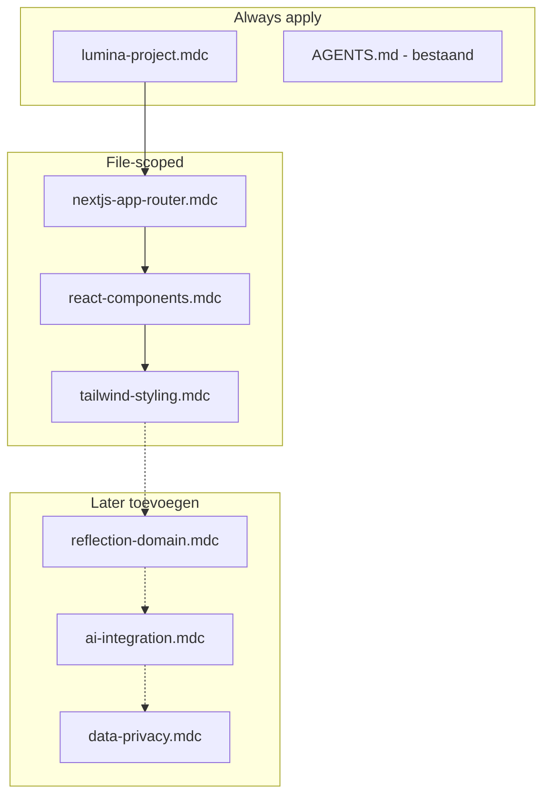

# Voorstel: Cursor rules voor Lumina

## Context

Lumina staat nog op de [create-next-app](https://nextjs.org) starter: Next.js **16.2**, React **19**, Tailwind **4**, TypeScript, App Router in [`app/`](../app/). Er is nog geen `.cursor/rules/` map; alleen [`AGENTS.md`](../AGENTS.md) met de Next.js-breaking-changes waarschuwing.

Rules horen in **`.cursor/rules/`** als `.mdc`-bestanden met YAML frontmatter (`description`, `globs`, `alwaysApply`). Houd elke rule **kort (<50 regels)** en **één onderwerp per bestand**.



---

## Aanbevolen mapstructuur (nu)

```
.cursor/rules/
  lumina-project.mdc          # alwaysApply: true
  nextjs-app-router.mdc       # globs: app/**/*
  react-components.mdc        # globs: **/*.tsx
  tailwind-styling.mdc        # globs: **/*.{tsx,css}
```

[`AGENTS.md`](../AGENTS.md) blijft staan voor de Next.js 16-specifieke waarschuwing — **niet dupliceren** in rules, alleen verwijzen.

---

## Rule 1: `lumina-project.mdc` (always apply)

**Doel:** Projectidentiteit, taal, en mappenconventies voor de huidige fase.

**Inhoud:**

- **Product:** Lumina is een reflectie-app — rustige, focus-vriendelijke UX; geen drukke dashboards in deze fase.
- **Taal:** UI-teksten, labels, foutmeldingen en placeholders in **Nederlands** (formeel maar warm: "je/jij" consistent kiezen en vasthouden).
- **Mappenstructuur** (vooraf vastleggen zodat groei ordelijk blijft):

```
app/
  (marketing)/          # landing, over — optioneel
  (app)/                # ingekapselde app-shell (layout + nav)
    page.tsx
components/
  ui/                   # herbruikbare primitives (Button, Input, Card)
  [feature]/            # domain-specifiek, bv. journal/ later
lib/
  types/                # gedeelde TypeScript types
  utils/                # pure helpers
```

- **Scope-discipline:** Geen database, auth of AI-logic toevoegen tot expliciet gevraagd.
- **Naamgeving:** PascalCase componenten, kebab-case route-mappen, camelCase functies/variabelen.
- **Metadata:** [`app/layout.tsx`](../app/layout.tsx) titel/description aanpassen naar Lumina (NL).

---

## Rule 2: `nextjs-app-router.mdc`

**Globs:** `app/**/*.{ts,tsx}`

**Inhoud:**

- App Router is leidend; geen Pages Router.
- **Server Components by default**; `"use client"` alleen bij state, effects, browser-API's of event handlers.
- Data fetching later via Server Components / Route Handlers — nu geen premature API-routes.
- **Verplichte verwijzing:** lees `node_modules/next/dist/docs/` bij twijfel over Next.js 16 API's (sluit aan op [`AGENTS.md`](../AGENTS.md)).
- Layouts: gedeelde shell in `app/(app)/layout.tsx`; pagina's blijven dun (compositie, geen grote UI-blokken inline).
- Route Handlers (later): `app/api/**/route.ts` met typed request/response.

**Voorbeeld in rule:**

```tsx
// Pagina: compositie
export default function ReflectiePage() {
  return <ReflectieForm />;
}

// Client alleen waar nodig
"use client";
export function ReflectieForm() { /* state + handlers */ }
```

---

## Rule 3: `react-components.mdc`

**Globs:** `**/*.tsx` (eventueel beperken tot `components/**` + `app/**` als noise te veel is)

**Inhoud:**

- Functionele componenten + hooks; geen class components.
- Props via TypeScript interfaces (`Readonly<{...}>` waar passend, zoals in [`app/layout.tsx`](../app/layout.tsx)).
- Splits presentatie (components) vs. pagina-compositie (app routes).
- Herbruikbare UI eerst in `components/ui/`; geen duplicate Button/Input per feature.
- Toegankelijkheid: semantische HTML (`main`, `nav`, `button`), `aria-label` waar tekst ontbreekt, focus states niet vergeten.
- Geen onnodige abstractie: pas hooks/components extraheren bij echte herhaling.

---

## Rule 4: `tailwind-styling.mdc`

**Globs:** `**/*.{tsx,css}`

**Inhoud:**

- Tailwind **v4** via [`app/globals.css`](../app/globals.css) (`@import "tailwindcss"`, `@theme inline`) — geen legacy `tailwind.config` tenzij later toegevoegd.
- Gebruik bestaande CSS-variabelen (`--background`, `--foreground`, `--font-sans`) i.p.v. willekeurige hex-waarden.
- Class-volgorde: layout → spacing → typography → kleur/achtergrond → states/responsive/dark.
- Dark mode via `prefers-color-scheme` (zoals starter); geen extra theme-toggle tot gevraagd.
- Reflectie-UX: ruime whitespace, leesbare typografie (`leading-relaxed`, voldoende `max-w-prose` voor tekstblokken), zachte borders/shadows.

---

## Later toevoegen (niet nu implementeren)

| Rule | Wanneer | Glob / scope |
|------|---------|--------------|
| `reflection-domain.mdc` | Journal/entries feature | `components/journal/**`, `app/**/journal/**` |
| `ai-integration.mdc` | AI-prompts/coaching | `lib/ai/**`, `app/api/**` |
| `data-privacy.mdc` | Auth + database | `lib/db/**`, server actions |

**reflection-domain:** entry-model (datum, inhoud, tags), autosave-gedrag, lege states ("Nog geen reflecties"), geen destructieve acties zonder bevestiging.

**ai-integration:** prompts in aparte bestanden, geen API-keys in client code, foutafhandeling NL, streaming UX.

**data-privacy:** reflecties zijn gevoelige data — encryptie/at-rest overwegingen, geen logging van inhoud, RLS als Supabase, etc.

---

## Wat we níet in rules zetten

- **ESLint-config** — al in [`eslint.config.mjs`](../eslint.config.mjs); rules dupliceren dat niet.
- **Volledige Next.js-docs** — alleen verwijzing + project-specifieke keuzes.
- **User rules uit Cursor settings** — die blijven globaal; project rules zijn Lumina-specifiek.

---

## Implementatiestappen

1. Map `.cursor/rules/` aanmaken.
2. Vier `.mdc`-bestanden schrijven met frontmatter en beknopte inhoud (<50 regels elk).
3. [`app/layout.tsx`](../app/layout.tsx) metadata bijwerken naar Lumina (NL) — optioneel maar consistent met project-rule.
4. Eerste feature-work (bv. app-shell + lege reflectie-pagina) valideren tegen de rules.

## Verwacht resultaat

Cursor krijgt bij elke sessie Lumina-context (NL, reflectie-UX, mappenstructuur) en bij het bewerken van app/component/style-bestanden stack-specifieke richtlijnen — zonder premature complexiteit voor AI, auth of database.
