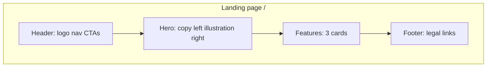

# Lumina landing page — plan

## Goal

Replace the create-next-app starter with a calm, informational landing page where visitors read about Lumina and see an **Inloggen** button (visual only, no separate page or auth yet).

Reference layout (from mockup):



---

## Route and file structure

Per [`.cursor/rules/lumina-project.mdc`](../rules/lumina-project.mdc), marketing lives in a route group:

```
app/
  (marketing)/
    layout.tsx              # page shell, aura background
    page.tsx                # composes sections → serves /
components/
  ui/
    Button.tsx              # primary | outline | dark variants
  marketing/
    Header.tsx
    Hero.tsx
    HeroIllustration.tsx    # gradient glow + simple SVG placeholder
    FeatureGrid.tsx
    FeatureCard.tsx
    Footer.tsx
public/
  (no hero asset yet — SVG inline in component)
```

- [`app/page.tsx`](../../app/page.tsx) removed; [`app/(marketing)/page.tsx`](../../app/(marketing)/page.tsx) serves `/`.
- All section components are **Server Components** except if a client wrapper is needed later for login.

---

## Page sections

### 1. Header (sticky)

| Element | Details |
|---------|---------|
| Logo | "Lumina" wordmark + small pen/journal SVG icon |
| Nav links | `Functies` → `#functies`, `Over ons` → `#over-ons`, `Prijzen` → `#prijzen` (anchor scroll) |
| CTA left | **Probeer gratis** — primary pill button (`bg-lumina-300`, text `lumina-900`) |
| CTA right | **Inloggen** — dark pill button (`bg-lumina-900`, text `surface`) — `<button type="button">`, no link, no handler |

Nav hidden on small screens behind a simple mobile menu is optional; for v1 a stacked header on mobile is enough.

### 2. Hero (two columns on `lg+`)

**Left — copy (Dutch):**

- H1 (serif): `Ontdek jezelf met` + accent **`Lumina`** in `text-lumina-500`
- Subtext: 2–3 sentences about a calm place to reflect and track what matters to you — **no AI claims** (scope: AI comes later)
- Buttons: **Probeer gratis** (primary) + **Bekijk meer** (outline, scrolls to `#functies`)

**Right — placeholder illustration (`HeroIllustration.tsx`):**

- Soft circular **aura glow** via CSS `radial-gradient` using `lumina-100` / `lumina-300` at low opacity (matches mockup mood)
- Simple inline SVG: seated figure + open journal/tablet + a few floating dots/nodes (abstract, not the mockup's AI coach)
- Comment in code: `// Replace with final illustration asset`

### 3. Features (`id="functies"`)

Three cards in a responsive grid (`1 col` → `3 col` on `md+`), adapted from mockup but reflection-focused:

| Icon | Title | Description |
|------|-------|-------------|
| Pen/journal SVG | Dagelijkse reflectie | Schrijf op wat je bezighoudt, op jouw tempo. |
| Chart SVG | Inzicht in patronen | Bekijk je reflecties terug en ontdek wat terugkomt. |
| Growth SVG | Intenties & groei | Stel intenties en volg je persoonlijke ontwikkeling. |

Each card: white `surface`, soft border `border-lumina-500/25`, icon in `lumina-500` circle.

### 4. Footer

- Links: `Privacy`, `Voorwaarden` (placeholder `#` for now)
- Copyright: `© 2026 Lumina`

---

## Styling

### Palette usage (from [`app/globals.css`](../../app/globals.css))

- Page background: `bg-background` with aura gradients overlaid in layout
- Headings/body: `text-foreground` / `text-muted`
- Primary CTA: `bg-lumina-300 text-lumina-900 hover:bg-lumina-100`
- Login button: `bg-lumina-900 text-surface hover:bg-lumina-700`
- Outline CTA: `border-lumina-500/25 hover:border-lumina-500`

### Typography

Mockup uses serif headlines. Google Font in [`app/layout.tsx`](../../app/layout.tsx):

- **Headlines:** Lora (serif, calm/premium feel)
- **Body/nav:** existing Geist Sans

Registered in `@theme inline` as `--font-serif` and used via `font-serif` on H1/H2.

### Aura background (marketing layout)

In [`app/(marketing)/layout.tsx`](../../app/(marketing)/layout.tsx) via `.marketing-aura` in globals.css:

```css
background-image:
  radial-gradient(ellipse 60% 50% at 20% 50%, lumina-100/30, transparent),
  radial-gradient(ellipse 50% 40% at 80% 20%, lumina-300/20, transparent);
```

Keep it subtle — 80/15/5 rule from [`.cursor/rules/tailwind-styling.mdc`](../rules/tailwind-styling.mdc).

---

## Reusable UI: `Button.tsx`

Single component in [`components/ui/Button.tsx`](../../components/ui/Button.tsx):

```tsx
type ButtonVariant = "primary" | "outline" | "dark";
// Renders <button> or <Link> via optional href prop
```

Used in Header, Hero, and later app screens. Rounded-full pills to match mockup.

---

## Scope boundaries (explicit)

| In scope | Out of scope |
|----------|--------------|
| Landing page UI at `/` | Real authentication |
| Inloggen button (no action) | `/inloggen` page |
| Anchor nav + placeholder footer links | Database, signup flow |
| Decorative SVG placeholder | Final hero illustration asset |
| Dutch copy | AI feature promises |

---

## Copy draft (Dutch)

**Hero H1:** Ontdek jezelf met **Lumina**

**Hero subtext:** Lumina is een rustige plek om te reflecteren. Schrijf op wat je bezighoudt, lees terug wanneer je wilt, en groei bewust — zonder afleiding.

**Over ons anchor (`#over-ons`):** Short paragraph below hero — no separate page yet.

**Prijzen anchor (`#prijzen`):** Single line under features: "Lumina is gratis te proberen." (placeholder until pricing exists)

---

## Implementation steps

1. Add serif font to [`app/layout.tsx`](../../app/layout.tsx) and `--font-serif` in [`app/globals.css`](../../app/globals.css)
2. Create [`components/ui/Button.tsx`](../../components/ui/Button.tsx)
3. Build marketing components (`Header`, `Hero`, `HeroIllustration`, `FeatureCard`, `FeatureGrid`, `Footer`)
4. Create [`app/(marketing)/layout.tsx`](../../app/(marketing)/layout.tsx) with aura background
5. Create [`app/(marketing)/page.tsx`](../../app/(marketing)/page.tsx) composing all sections
6. Remove [`app/page.tsx`](../../app/page.tsx)
7. Save plan to [`.cursor/plans/lumina-landing-page.md`](lumina-landing-page.md)

---

## Verification

- `npm run dev` → `/` shows full landing page in Dutch
- Lumina palette visible (no zinc/black hardcoded values)
- **Inloggen** renders as button, does nothing on click
- Nav anchors scroll to features section
- Responsive: stacked hero on mobile, two columns on desktop
- Lighthouse/accessibility: semantic `header`, `main`, `footer`, `nav`, heading hierarchy

---

## Status

All implementation steps completed. Build verified with `npm run build`.
