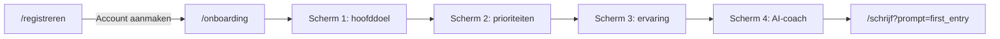

# Onboarding flow na registratie

## Flow



---

## 1. Registratie koppelen aan onboarding

Wijzig [`components/marketing/RegisterCard.tsx`](../../components/marketing/RegisterCard.tsx):

- Form state met `useState` (naam, e-mail, wachtwoord) of `FormData` in submit
- HTML-validatie: `required` op alle velden, `minLength={8}` op wachtwoord
- Uitbreiden [`components/ui/Input.tsx`](../../components/ui/Input.tsx) met optionele props: `required`, `minLength`, `value`, `onChange`
- Bij succesvolle submit:
  1. Naam opslaan in `sessionStorage` onder `lumina-user-name`
  2. `router.replace("/onboarding")` — popup verdwijnt doordat `/registreren` verlaten wordt

---

## 2. Route en layout (geen app-nav)

Nieuwe route group **`app/(onboarding)/`** — buiten [`app/(app)/layout.tsx`](../../app/(app)/layout.tsx) zodat er geen `AppHeader` of navigatie is.

| Bestand | Doel |
|---------|------|
| [`app/(onboarding)/layout.tsx`](../../app/(onboarding)/layout.tsx) | `marketing-aura`, `min-h-screen`, gecentreerde inhoud, subtiel Lumina-logo bovenaan |
| [`app/(onboarding)/onboarding/page.tsx`](../../app/(onboarding)/onboarding/page.tsx) | Dunne server page die `<OnboardingWizard />` rendert |

**Footer:** Root layout toont altijd [`Footer`](../../components/layout/Footer.tsx). Voeg een kleine client wrapper `FooterGate` toe die de footer verbergt op `/onboarding` — anders ondermijnt de footer het rustige, paginagrote gevoel.

---

## 3. Data en types (geen database)

Nieuw [`lib/types/onboarding.ts`](../../lib/types/onboarding.ts):

```ts
export type OnboardingMainGoal = "mental-health" | "gratitude" | ...;
export type OnboardingPriority = "creativity" | "relationships" | ...;
export type JournalExperience = "first-time" | "some" | "experienced";
export type AiCoachStyle = "empathetic" | "direct";

export interface OnboardingAnswers {
  mainGoal: OnboardingMainGoal | null;
  priorities: OnboardingPriority[];
  experience: JournalExperience | null;
  coachStyle: AiCoachStyle | null;
}
```

Nieuw [`lib/constants/onboarding.ts`](../../lib/constants/onboarding.ts) — alle stapdefinities met Nederlandse labels en ids (DB-ready). Copy exact volgens specificatie:

**Scherm 1** (single): Mental Health verbeteren, Dankbaarheid stimuleren, Ontdekken van patronen en triggers, Belangrijkse gebeurtenissen vastleggen, Mezelf uitdrukken, Personelijke groei bijhouden

**Scherm 2** (multi): Creatieviteit en expressie, Relaties, Balans en doelen in mijn leven, Werk en carrière, Persoonlijke ontwikkeling, Gezondheid en welzijn

**Scherm 3** (single): Dit is de eerste keer, Al een paar keer gedaan, Behoorlijk wat ervaring

**Scherm 4** (single, met beschrijving): De Empathische Luisteraar + De Directe Gids (inclusief subteksten uit specificatie). Onder de kaarten: *Je kunt je coach later aanpassen in Instellingen.*

Na voltooiing: antwoorden JSON in `sessionStorage` onder `lumina-onboarding-answers` (klaar voor latere DB-koppeling).

---

## 4. UI-componenten

### [`components/ui/SelectionCard.tsx`](../../components/ui/SelectionCard.tsx) (nieuw)

Herbruikbare klikbare kaart met duidelijk actief/inactief onderscheid:

| Staat | Styling |
|-------|---------|
| Inactief | `border-lumina-500/25 bg-surface hover:border-lumina-500/50` |
| Actief | `border-lumina-500 bg-lumina-300/15 ring-2 ring-lumina-100/50` |

- Semantisch: `<button type="button">` met `aria-pressed` (multi) of geselecteerde staat visueel
- Optionele `description` prop voor coach-kaarten (scherm 4)
- `font-serif` titel, `text-muted` beschrijving, royale padding (`p-5`/`p-6`), `rounded-2xl`, rustige `transition-colors`

### [`components/onboarding/OnboardingWizard.tsx`](../../components/onboarding/OnboardingWizard.tsx) (nieuw, client)

Step-state machine (`step` 1–4) met gedeelde `OnboardingAnswers` state:

| Scherm | Selectie | Navigatie |
|--------|----------|-----------|
| 1 | Single | Tik op kaart → direct door naar stap 2 |
| 2 | Multi | Toggle kaarten; knop **Volgende** (disabled tot min. 1 keuze) |
| 3 | Single | Tik op kaart → direct door naar stap 4 |
| 4 | Single | Tik op kaart → opslaan + `router.push("/schrijf?prompt=first_entry")` |

**Scherm 1 titel:** `Wat brengt je bij Lumina, [Naam]?` — naam uit `sessionStorage` (`lumina-user-name`), fallback `"daar"` als leeg.

**Subtekst scherm 1:** *Kies je hoofddoel (je kunt dit later altijd aanpassen).*

**Layout per stap:**
- Subtiele voortgang: *Stap X van 4* (`text-sm text-muted`)
- Gecentreerde `font-serif` titel (`text-3xl`/`text-4xl`)
- Optionele subtekst
- Responsive grid: `grid gap-3 sm:grid-cols-2` (scherm 4: `max-w-2xl`, grotere kaarten)
- Terug-knop op stappen 2–4 (links boven) voor correctie

---

## 5. Eerste entry op `/schrijf`

Uitbreiden [`lib/types/writing.ts`](../../lib/types/writing.ts) en [`lib/mock/writing.ts`](../../lib/mock/writing.ts):

- Nieuw prompt-type: `first_entry`
- Hint: *Schrijf je eerste entry.*

Wijzig [`app/(app)/schrijf/page.tsx`](../../app/(app)/schrijf/page.tsx): `first_entry` toevoegen aan `validPromptTypes`.

Na onboarding landt de gebruiker op `/schrijf` met de app-shell (header aanwezig) en de rustige schrijf-UI met bovenstaande hint via bestaande [`WritingArea`](../../components/journal/WritingArea.tsx).

---

## Buiten scope

- Database-persistentie en auth
- Werkelijke coach-wissel in instellingen (alleen copy-verwijzing op scherm 4)
- Validatie van e-mailformaat buiten HTML5 `type="email"`

---

## Testplan

- Registratie met lege velden → browser toont verplicht-meldingen
- Registratie met ingevulde velden → `/onboarding`, popup weg
- Scherm 1 toont naam uit formulier
- Single-select schermen: één actieve kaart, directe voortgang
- Scherm 2: meerdere kaarten actief, Volgende pas na selectie
- Scherm 4: coach-beschrijvingen zichtbaar, actief/inactief duidelijk
- Afronding → `/schrijf` met hint *Schrijf je eerste entry.*
- `sessionStorage` bevat `lumina-user-name` en `lumina-onboarding-answers`
- Geen footer en geen app-nav op `/onboarding`
