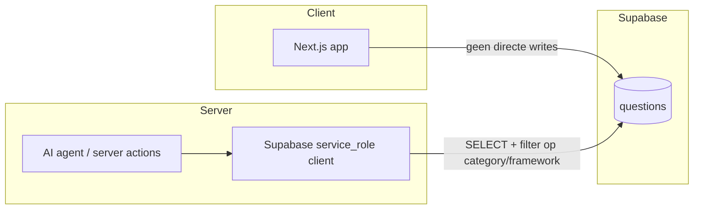
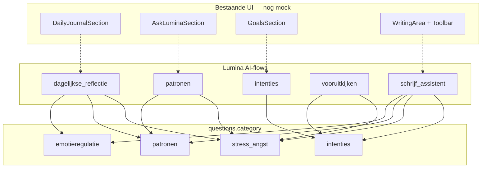
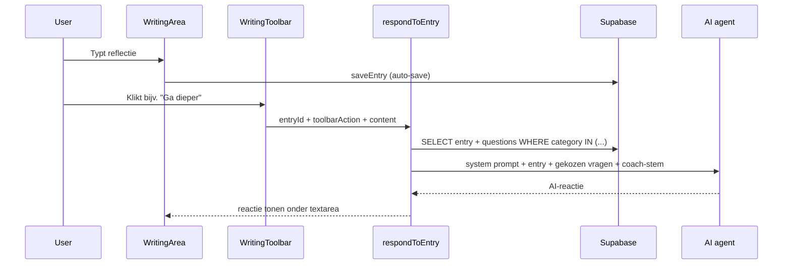

# Plan: `questions`-tabel in Supabase

## Context

Het bestaande schema in [`supabase/migrations/20250615000000_initial_schema.sql`](supabase/migrations/20250615000000_initial_schema.sql) gebruikt overal **UUID** als `id` (`gen_random_uuid()`), `text` voor vrije tekst, RLS op elke tabel, en expliciete `GRANT`s per rol.

Er is nog geen `questions`-tabel of TypeScript-type.

**Gebruik:** de tabel is een **gedeelde catalogus voor de AI-agent** (server-side), niet bedoeld voor directe bewerking door eindgebruikers in de UI.



## Ontwerpkeuzes

| Beslissing | Keuze | Reden |
|------------|-------|-------|
| `id`-type | **UUID** | Consistent met `entries`, `habits_and_intentions`, etc. |
| `user_id` | **Geen** | Gedeelde catalogus, geen per-gebruiker vragen |
| Kolomtypes | `text NOT NULL` voor `category`, `framework`, `question_text` | Zoals gevraagd |
| Validatie | **CHECK constraints** op `category` en `framework` | Vaste taxonomie van 4 categorieën × 4 frameworks; voorkomt typos bij toekomstige seeds |
| Client-toegang | **Geen INSERT/UPDATE/DELETE** voor `authenticated` | AI beheert via server; data via migraties |
| Server/AI-toegang | **`service_role`** (bypass RLS) + **SELECT voor `authenticated`** | Server actions met user-session kunnen vragen ophalen |
| Seed | **14 psychologische reflectievragen** | Door gebruiker opgegeven, verdeeld over 4 therapeutische categorieën |

### Seed-taxonomie (14 vragen)

| category | framework | Therapeutisch kader | Aantal |
|----------|-----------|---------------------|--------|
| `stress_angst` | `cbt` | CGT (cognitieve gedragstherapie) | 4 |
| `patronen` | `groei_reflectie` | Groei & reflectie | 4 |
| `intenties` | `gedragsactivatie` | Gedragsactivatie | 3 |
| `emotieregulatie` | `act` | ACT (acceptance & commitment) | 3 |

## Stap 1 — Volledig migratiebestand

Maak [`supabase/migrations/20250622000000_questions.sql`](supabase/migrations/20250622000000_questions.sql):

```sql
-- Reflectievragen-catalogus voor AI-agent (14 psychologische vragen)

CREATE TABLE public.questions (
    id uuid PRIMARY KEY DEFAULT gen_random_uuid(),
    category text NOT NULL,
    framework text NOT NULL,
    question_text text NOT NULL,
    CONSTRAINT questions_category_check CHECK (
        category IN ('stress_angst', 'patronen', 'intenties', 'emotieregulatie')
    ),
    CONSTRAINT questions_framework_check CHECK (
        framework IN ('cbt', 'groei_reflectie', 'gedragsactivatie', 'act')
    )
);

COMMENT ON TABLE public.questions IS
    'Gedeelde catalogus van reflectievragen voor de Lumina AI-agent.';
COMMENT ON COLUMN public.questions.category IS
    'Thematische categorie: stress_angst, patronen, intenties, emotieregulatie.';
COMMENT ON COLUMN public.questions.framework IS
    'Therapeutisch kader: cbt, groei_reflectie, gedragsactivatie, act.';

CREATE INDEX questions_category_framework_idx
    ON public.questions (category, framework);

ALTER TABLE public.questions ENABLE ROW LEVEL SECURITY;

CREATE POLICY "Authenticated users can read questions"
    ON public.questions FOR SELECT
    TO authenticated
    USING (true);

-- Geen INSERT/UPDATE/DELETE policies voor authenticated/anon
-- service_role bypass RLS voor AI-backend

GRANT SELECT ON public.questions TO authenticated;
GRANT ALL ON public.questions TO postgres, service_role;

-- Voeg alle 14 psychologische reflectievragen toe aan de database
INSERT INTO public.questions (category, framework, question_text)
VALUES
    -- CATEGORIE 1: STRESS & ANGST VERMINDEREN (CGT)
    (
        'stress_angst',
        'cbt',
        'Welke gedachte houdt je op dit moment het meest bezig, en welk bewijs heb je dat deze gedachte 100% waar is?'
    ),
    (
        'stress_angst',
        'cbt',
        'Als een goede vriend(in) in exact dezelfde situatie zou zitten met dezelfde stress, welk advies zou je hem of haar dan geven?'
    ),
    (
        'stress_angst',
        'cbt',
        'Wat ligt er op dit moment écht binnen jouw controle, en wat probeer je te controleren waar je eigenlijk geen invloed op hebt?'
    ),
    (
        'stress_angst',
        'cbt',
        'Schrijf het absolute worst-case scenario op dat nu in je hoofd zit. Wat zou je doen als dit écht gebeurt? Hoe overleef je dat?'
    ),

    -- CATEGORIE 2: PATRONEN & ZELFINZICHT (GROEI & REFLECTIE)
    (
        'patronen',
        'groei_reflectie',
        'Wanneer voelde je je vandaag het meest energiek of juist het meest leeggezogen? Wat of wie veroorzaakte die omslag?'
    ),
    (
        'patronen',
        'groei_reflectie',
        'Merk je dat de situatie van vandaag je doet denken aan een ervaring uit je verleden? Welke ''ongeschreven regel'' ben je nu aan het volgen?'
    ),
    (
        'patronen',
        'groei_reflectie',
        'Wat probeer je op dit moment te vermijden door zo druk te zijn of je hier zo intens op te focussen?'
    ),
    (
        'patronen',
        'groei_reflectie',
        'Als je de situatie van vandaag vanuit een helikoptervlucht bekijkt, welk aandeel had jij dan zelf in het verloop ervan?'
    ),

    -- CATEGORIE 3: INTENTIES & GEWOONTES (GEDRAGSACTIVATIE)
    (
        'intenties',
        'gedragsactivatie',
        'Welke kleine, concrete actie van maximaal 5 minuten kun je morgen doen om een stapje dichter bij je doel te komen?'
    ),
    (
        'intenties',
        'gedragsactivatie',
        'Wat hield je vandaag tegen om je aan je voorgenomen intentie te houden, en hoe kun je die drempel morgen lager maken?'
    ),
    (
        'intenties',
        'gedragsactivatie',
        'Als je kijkt naar je weekdoel, op welk moment van de dag was je daar vandaag bewust mee bezig?'
    ),

    -- CATEGORIE 4: EMOTIEREGULATIE & ACCEPTATIE (ACT)
    (
        'emotieregulatie',
        'act',
        'Als je de emotie die je nu voelt een vorm, kleur of textuur zou moeten geven, hoe ziet die er dan uit?'
    ),
    (
        'emotieregulatie',
        'act',
        'Welk gevoel probeer je op dit moment weg te duwen? Wat gebeurt er als je er simpelweg een paar minuten naar kijkt en het er laat zijn?'
    ),
    (
        'emotieregulatie',
        'act',
        'Wat zegt deze specifieke frustratie of pijn over wat jij écht belangrijk vindt in het leven (jouw kernwaarden)?'
    );
```

**Verbeteringen t.o.v. vorige planversie:**

- **CHECK constraints** op `category` en `framework` — data-integriteit voor de vaste taxonomie
- **`COMMENT ON`** — documenteert doel en geldige waarden in de database zelf
- **Volledige seed** — alle 14 vragen exact zoals opgegeven (inclusief correct geëscapte apostrof in `''ongeschreven regel''`)
- **Eén migratiebestand** — DDL + seed atomisch, geen apart seed-script nodig

**Belangrijk:** nieuwe tabellen krijgen in dit project **geen** automatische grants (`auto_expose_new_tables` staat uit in [`supabase/config.toml`](supabase/config.toml)). De `GRANT`-regels zijn verplicht.

## Stap 2 — Migratie toepassen

**Lokaal** (als Supabase CLI draait):

```bash
supabase db reset   # of: supabase migration up
```

**Remote project** (na goedkeuring):

- Migratiebestand committen
- Toepassen via Supabase MCP `apply_migration`, **of** `supabase db push`

**Verificatie:**

```sql
-- Totaal moet 14 zijn
SELECT COUNT(*) FROM public.questions;

-- Per categorie/framework
SELECT category, framework, COUNT(*) AS aantal
FROM public.questions
GROUP BY category, framework
ORDER BY category;

-- Verwacht:
-- stress_angst      | cbt               | 4
-- patronen          | groei_reflectie   | 4
-- intenties         | gedragsactivatie  | 3
-- emotieregulatie   | act               | 3
```

Optioneel: Supabase MCP `list_tables` en `get_advisors` (security) na deploy.

## Stap 3 — TypeScript-types bijwerken

Uitbreiden van [`lib/types/database.ts`](lib/types/database.ts) met vaste unions (nu de taxonomie bekend is):

```typescript
export type QuestionCategory =
  | "stress_angst"
  | "patronen"
  | "intenties"
  | "emotieregulatie";

export type QuestionFramework =
  | "cbt"
  | "groei_reflectie"
  | "gedragsactivatie"
  | "act";

export interface Question {
  id: string;
  category: QuestionCategory;
  framework: QuestionFramework;
  question_text: string;
}
```

En toevoegen aan `Database.public.Tables.questions`:

```typescript
questions: {
  Row: Question;
  Insert: Omit<Question, "id"> & { id?: string };
  Update: Partial<Omit<Question, "id">>;
};
```

Dit geeft compile-time validatie wanneer de AI-agent later vragen filtert op categorie of framework.

## Stap 4 — AI-gebruik: dashboard-flows én schrijf-flow

**Ja — deze vragen zijn bedoeld om door de AI-agent te worden opgeput**, zowel op het dashboard als **tijdens het schrijven van een entry** op [`/schrijf`](app/(app)/schrijf/page.tsx). De database-categorieën sluiten niet 1-op-1 aan op UI-labels; de AI koppelt ze via een **use-case mapping** in applicatiecode.



### Mapping: dashboard-flows → database-categorieën

| Lumina AI-flow | `questions.category` | Voorbeeldvragen uit seed | Bestaande UI / data |
|----------------|----------------------|--------------------------|---------------------|
| **Dagelijkse reflectie** | `emotieregulatie`, `patronen`, `stress_angst` | Emotie als vorm/kleur; energiek vs. leeggezogen; gedachte die je bezighoudt | [`DailyJournalSection`](components/dashboard/DailyJournalSection.tsx), WritingToolbar "Vraag" |
| **Patronen herkennen** | `patronen` (primair), `stress_angst` (triggers) | Ongeschreven regel; vermijdingsgedrag; helikoptervlucht | [`AskLuminaSection`](components/dashboard/AskLuminaSection.tsx), WritingToolbar "Eerdere gedragspatronen", [`ai_insights`](supabase/migrations/20250615000000_initial_schema.sql) |
| **Intenties** | `intenties` | 5-min actie; drempel verlagen; weekdoel-bewustzijn | [`GoalsSection`](components/dashboard/GoalsSection.tsx), `habits_and_intentions`, `habit_logs.ai_checkin_prompt` |
| **Vooruitkijken** | `intenties` (primair), `stress_angst` (resilience) | Morgen-actie; weekdoel; worst-case overlevingsscenario | Intenties-card, toekomstgerichte AI-insights |

### Schrijf-flow: AI reageert op de huidige entry

Op [`/schrijf`](app/(app)/schrijf/page.tsx) slaat [`WritingArea`](components/journal/WritingArea.tsx) de entry al op via `saveEntry` (auto-save + handmatig). De [`WritingToolbar`](components/journal/WritingToolbar.tsx) heeft 8 AI-knoppen die nu **mock/no-op** zijn — hier komt de `questions`-tabel het sterkst tot zijn recht: de AI leest de **huidige entry-inhoud** en put **gerichte vervolgvragen** uit de catalogus.



#### Toolbar-knop → vraagcategorieën

| Toolbar-knop | Doel van AI-reactie | `questions.category` |
|--------------|---------------------|----------------------|
| **Vraag** | Stelt één gerichte vervolgvraag op basis van wat je net schreef | `emotieregulatie`, `patronen`, `stress_angst` |
| **Ga dieper** | Daagt uit om verder te graven in emoties of vermijding | `patronen`, `emotieregulatie` |
| **Coach me** | Praktisch advies of kleine volgende stap | `intenties`, `stress_angst` |
| **Vat samen** | Geen vraag uit catalogus — AI vat entry samen | — |
| **Geef inzicht** | Verbindt huidige tekst met zelfinzicht / kernwaarden | `patronen`, `emotieregulatie` |
| **Eerdere gedragspatronen** | Vergelijkt met eerdere entries + patroonvragen | `patronen`, `stress_angst` |
| **Actie punten** | Concrete vervolgacties (gedragsactivatie) | `intenties` |
| **Geef feedback** | Ondersteunende terugkoppeling in coach-stem | `stress_angst`, `emotieregulatie` |

Knoppen als "Vat samen" gebruiken de `questions`-tabel niet direct; de overige zes putten er wél uit.

**Hoe de AI put uit (vervolgstap, geen onderdeel van de migratie zelf):**

1. Bepaal context: dashboard-sectie, toolbar-knop, of onboarding-doel.
2. Haal relevante vragen op server-side op:

```sql
SELECT question_text, framework
FROM public.questions
WHERE category = ANY($1)  -- bijv. ARRAY['patronen', 'emotieregulatie']
ORDER BY random()
LIMIT 2;
```

3. Voeg gekozen vragen + **huidige entry-inhoud** (`entries.content`) toe aan de system prompt, plus optioneel recente entries en actieve intenties.
4. Laat de AI de vraag **herformuleren** in de stem van de gekozen coach (`profiles.ai_persona_preference`) en als **reactie** teruggeven — niet als kale copy-paste van de databasevraag.

### Helper (vervolgstap na migratie)

Nieuw bestand [`lib/ai/question-context.ts`](lib/ai/question-context.ts):

```typescript
export type AiUseCase =
  | "dagelijkse_reflectie"
  | "patronen"
  | "intenties"
  | "vooruitkijken";

export type ToolbarAiAction =
  | "vraag"
  | "ga_dieper"
  | "coach_me"
  | "geef_inzicht"
  | "eerdere_gedragspatronen"
  | "actie_punten"
  | "geef_feedback";

const USE_CASE_CATEGORIES: Record<AiUseCase, QuestionCategory[]> = {
  dagelijkse_reflectie: ["emotieregulatie", "patronen", "stress_angst"],
  patronen: ["patronen", "stress_angst"],
  intenties: ["intenties"],
  vooruitkijken: ["intenties", "stress_angst"],
};

const TOOLBAR_ACTION_CATEGORIES: Record<ToolbarAiAction, QuestionCategory[]> = {
  vraag: ["emotieregulatie", "patronen", "stress_angst"],
  ga_dieper: ["patronen", "emotieregulatie"],
  coach_me: ["intenties", "stress_angst"],
  geef_inzicht: ["patronen", "emotieregulatie"],
  eerdere_gedragspatronen: ["patronen", "stress_angst"],
  actie_punten: ["intenties"],
  geef_feedback: ["stress_angst", "emotieregulatie"],
};

export async function getQuestionsForUseCase(
  useCase: AiUseCase,
  limit = 2,
): Promise<Question[]> { /* ... */ }

export async function getQuestionsForToolbarAction(
  action: ToolbarAiAction,
  limit = 2,
): Promise<Question[]> { /* ... */ }
```

Server action [`lib/ai/respond-to-entry.ts`](lib/ai/respond-to-entry.ts) (vervolgstap):

```typescript
export async function respondToEntry(
  entryId: string,
  action: ToolbarAiAction,
): Promise<{ response: string } | { error: string }> {
  // 1. Haal entry.content op (eigen entry, RLS)
  // 2. getQuestionsForToolbarAction(action)
  // 3. LLM-aanroep met coach-stem + entry + vragen
  // 4. Retourneer AI-reactie (niet opslaan in DB in MVP — alleen tonen)
}
```

Geen extra databasekolom `use_case` nodig: één vraag kan in meerdere flows passen. De mapping in code is flexibeler dan een vaste kolom.

### Wat deze stap níet doet

Geen wijzigingen aan UI of AI-backend in de migratiestap zelf:

- [`AskLuminaSection`](components/dashboard/AskLuminaSection.tsx) blijft `sampleQuestions` gebruiken tot AI-integratie
- [`WritingToolbar`](components/journal/WritingToolbar.tsx) AI-knoppen hebben nog geen `onClick` → `respondToEntry`
- Er is nog **geen UI-paneel** voor AI-reacties onder de textarea in `WritingArea` — dat is onderdeel van de entry-AI vervolgtaak

Die koppeling is een **aparte vervolgtaak** zodra de `questions`-tabel live staat.

## Samenvatting bestanden

| Actie | Bestand |
|-------|---------|
| Nieuw | `supabase/migrations/20250622000000_questions.sql` |
| Wijzig | `lib/types/database.ts` |
| Nieuw (vervolgstap) | `lib/ai/question-context.ts` — use-case + toolbar-action mapping |
| Nieuw (vervolgstap) | `lib/ai/respond-to-entry.ts` — server action voor AI-reactie op entry |
| Wijzig (vervolgstap) | [`WritingArea`](components/journal/WritingArea.tsx) + [`WritingToolbar`](components/journal/WritingToolbar.tsx) — AI-reactiepaneel + onClick-handlers |

## Risico's / aandachtspunten

- **Service role key** alleen server-side, nooit in client bundles.
- **Geen anon SELECT** — vragen zijn niet publiek; alleen ingelogde flows of `service_role`.
- **CHECK constraints** betekenen dat nieuwe vragen alleen via migratie of `service_role` met geldige `category`/`framework`-waarden kunnen worden toegevoegd. Bij uitbreiding van de taxonomie: nieuwe migratie met `ALTER TABLE ... DROP CONSTRAINT` + nieuwe CHECK, of constraint aanpassen.
- Als de AI later **runtime vragen moet toevoegen**, is een server action met `service_role` nodig; client-side writes blijven geblokkeerd.
