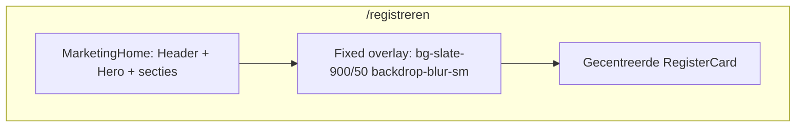

# Registreerpagina layout

## Antwoord op je vraag

**Je hebt de dedicated route `/registreren` nodig** (optie 1) — niet per se intercepting routes.

Beide opties kunnen de landingspagina als achtergrond tonen, maar ze werken anders:

| Aanpak | Zie je de landing? | URL | Complexiteit |
|--------|-------------------|-----|--------------|
| **Dedicated `/registreren`** | Ja — landing + overlay op dezelfde pagina | `/registreren` | Laag |
| **Intercepting `@modal`** | Ja — modal over `/` bij klik vanaf home | `/` of `/registreren` | Hoog |

Voor jouw ontwerp (donkere waas `bg-slate-900/50 backdrop-blur-sm` over de landing) volstaat **optie 1**: op [`app/(marketing)/registreren/page.tsx`](../../app/(marketing)/registreren/page.tsx) renderen we dezelfde landing-inhoud **én** een `fixed inset-0` overlay met de kaart erbovenop. De bezoeker ziet Header, Hero en features gedimd en wazig achter de modal.

Intercepting routes zijn alleen nodig als je de URL op `/` wilt houden terwijl de modal open is — dat is een UX-verfijning, geen vereiste voor het zichtbare effect.



---

## Bestaande patronen hergebruiken

- **Modal-structuur**: volg [`components/dashboard/AddGoalModal.tsx`](../../components/dashboard/AddGoalModal.tsx) — `fixed inset-0 z-50`, `role="dialog"`, Escape-toets, backdrop-klik sluit.
- **Input-styling**: hergebruik `fieldClassName` uit AddGoalModal (`rounded-xl border border-lumina-500/25 bg-surface ...`).
- **Button**: [`components/ui/Button.tsx`](../../components/ui/Button.tsx) — brede submit-knop via `className="w-full"`.
- **Logo**: [`components/ui/Logo.tsx`](../../components/ui/Logo.tsx) — cirkel-logo (L met sterretjes), subtiel met `opacity-70` en kleiner (`h-6 w-6`).

---

## Nieuwe en gewijzigde bestanden

### 1. `components/ui/Input.tsx` (nieuw)

Herbruikbaar label + input, conform projectstructuur (`components/ui/`). Props: `id`, `label`, `type`, `placeholder`, optioneel `autoComplete`.

### 2. `components/marketing/MarketingHome.tsx` (nieuw)

Extraheer de landing-compositie uit [`app/(marketing)/page.tsx`](../../app/(marketing)/page.tsx) (Header, main-secties) zodat `/` en `/registreren` dezelfde achtergrond delen zonder duplicatie.

### 3. `components/marketing/RegisterCard.tsx` (nieuw, `"use client"`)

Gecentreerde kaart met:

**Bovenkant**
- Subtiel [`Logo`](../../components/ui/Logo.tsx), gecentreerd
- Sluitknop (X) rechtsboven → `router.push("/")` + `aria-label="Sluiten"`
- Titel: *Creëer je gratis account* (`font-serif`)

**Formulier** (visueel only, `preventDefault` op submit)
- Voornaam — placeholder: *Hoe mogen we je noemen?*
- E-mailadres — placeholder: *naam@voorbeeld.com*
- Wachtwoord — placeholder: *Minimaal 8 tekens*
- Knop: *Account aanmaken ✦* — `variant="primary"`, `type="submit"`, `w-full`

**Onderkant**
- *Heb je al een account?* [`Log in`](/inloggen) — link-styling `text-lumina-500 hover:text-lumina-700`
- Privacy: *🔒 Je data is end-to-end beveiligd en 100% privé.* — `text-sm text-muted`

Kaart-styling: `max-w-md rounded-2xl border border-lumina-500/25 bg-surface p-6 shadow-lg` (consistent met bestaande modals).

### 4. `components/marketing/RegisterOverlay.tsx` (nieuw, `"use client"`)

Wrapper rond RegisterCard:
- Backdrop: `bg-slate-900/50 backdrop-blur-sm` (zoals gespecificeerd)
- `z-50` zodat overlay boven sticky header (`z-10`) ligt
- Backdrop-klik en Escape sluiten → navigeer naar `/`

### 5. `app/(marketing)/registreren/page.tsx` (nieuw)

```tsx
export default function RegisterPage() {
  return (
    <>
      <MarketingHome />
      <RegisterOverlay />
    </>
  );
}
```

### 6. CTAs koppelen

Wijzig in [`components/marketing/Hero.tsx`](../../components/marketing/Hero.tsx) en [`components/marketing/Header.tsx`](../../components/marketing/Header.tsx):
- *Probeer gratis* → `href="/registreren"` (i.p.v. `#functies`)

---

## Buiten scope (nu niet bouwen)

- Auth, validatie, API, database
- Werkende login-flow (`/inloggen` is alleen een link)
- Intercepting routes (`@modal` slot)

---

## Testplan

- Ga naar `/registreren` — landing zichtbaar achter wazige overlay, kaart gecentreerd
- Klik X, backdrop of druk Escape → terug naar `/`
- Klik *Probeer gratis* op `/` → navigeert naar `/registreren` met zelfde effect
- Tab door formulier — focus-states zichtbaar op inputs en knoppen
- Controleer op mobiel: kaart past binnen viewport (`p-4` op overlay)
