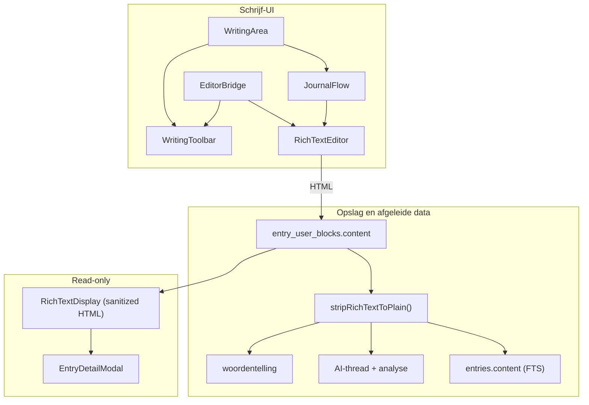

# Rich-text editor en tekststijl

## Status

- [x] Plan opgeslagen
- [ ] Implementatie

## Doel

Vervang de plain-text textarea door een TipTap rich-text editor, koppel de bestaande format-toolbar aan echte editor-commando's, en sla HTML op in `entry_user_blocks.content` met plain-text extractie voor AI, zoeken en woordentelling.

**Opslagkeuze:** HTML in bestaande `text`-kolom. Geen databasemigratie nodig.

## Huidige situatie

De format-toolbar in [`components/journal/WritingToolbar.tsx`](../../components/journal/WritingToolbar.tsx) is **UI-only**: knoppen togglen alleen lokale state (`activeFormats`) en roepen geen editor aan. Undo/redo zijn no-op (`onClick={() => undefined}`).

De schrijfweergave gebruikt een gewone `<textarea>` in [`components/journal/JournalFlow.tsx`](../../components/journal/JournalFlow.tsx) — die ondersteunt geen vet/cursief/koppen/lijsten.

Dit was bewust zo gepland in [`schrijf-toolbar-menu.md`](schrijf-toolbar-menu.md) (“Formatting blijft UI-only”). Nu wordt dat alsnog geïmplementeerd.

## Gewenste architectuur



## Technische keuze: TipTap

Installeer TipTap — past bij React/Next.js en de bestaande toolbar-UX (WYSIWYG + toggle-states + undo/redo).

**Packages (indicatief):**

- `@tiptap/react`, `@tiptap/pm`
- `@tiptap/starter-kit` (bold, italic, strike, headings, lists, undo/redo, paragraph)
- `@tiptap/extension-underline`
- `@tiptap/extension-horizontal-rule` (divider)
- `isomorphic-dompurify` (veilig HTML renderen server/client)

**Custom extensies** (klein, voor toolbar-pariteit):

- `SmallCaps` mark → `font-variant: small-caps` via CSS class
- `Title` node of heading-level → grotere serif titel (visueel onderscheiden van gewone “Kop”)

## Kerncomponenten

### 1. `lib/utils/rich-text.ts`

Centrale hulpfuncties:

| Functie | Doel |
|---------|------|
| `stripRichTextToPlain(html)` | HTML → platte tekst (AI, `hasUserText`, woordentelling) |
| `sanitizeRichTextHtml(html)` | Whitelist voor read-only weergave |
| `isRichTextEmpty(html)` | Lege editor (`<p></p>`) detecteren |
| `normalizeEditorContent(input)` | Bestaande plain-text entries laden als `<p>…</p>` |

### 2. `components/journal/RichTextEditor.tsx`

Client component die TipTap opzet met de Lumina “onzichtbare editor”-stijl:

- Zelfde typografie als nu: `font-serif text-lg leading-relaxed`, geen rand/achtergrond
- Auto-groeiende hoogte (min-height + `onUpdate` resize, vergelijkbaar met huidige `AutoGrowTextarea`)
- Props: `blockId`, `content` (HTML), `autoFocus`, `onChange(blockId, html)`, `onFocus`, `onEditorReady(editor)`
- `editable={!readOnly}` voor hergebruik in geschiedenis

**Prose-styling** via Tailwind in editor container, bijv.:

```css
/* conceptueel — in component classes */
[&_strong]:font-semibold
[&_em]:italic
[&_u]:underline
[&_s]:line-through
[&_h2]:text-xl [&_h2]:font-medium
[&_.lumina-title]:text-2xl [&_.lumina-title]:font-semibold
[&_.lumina-small-caps]:[font-variant:small-caps]
```

### 3. `components/journal/EditorBridge.tsx` (of context)

Koppelt toolbar aan de **actieve** editor (welk user-blok focus heeft):

- `registerEditor(blockId, editor)` / `unregisterEditor(blockId)`
- `getActiveEditor()` — laatst gefocuste editor
- `onSelectionUpdate` → toolbar active-states verversen

Meerdere user-blokken bestaan na AI-acties; formatting geldt standaard op het blok met focus (meestal het laatste actieve blok).

### 4. Toolbar koppelen — [`WritingToolbar.tsx`](../../components/journal/WritingToolbar.tsx)

Vervang lokale `activeFormats` state door editor-commando's:

| Toolbar-id | TipTap-actie |
|------------|--------------|
| `bold` | `chain().focus().toggleBold()` |
| `italic` | `toggleItalic()` |
| `underline` | `toggleUnderline()` |
| `strikethrough` | `toggleStrike()` |
| `heading` | `toggleHeading({ level: 2 })` |
| `bullet` | `toggleBulletList()` |
| `numbered` | `toggleOrderedList()` |
| `smallcaps` | custom `toggleSmallCaps` |
| `title` | custom `toggleTitle` |
| `divider` | `setHorizontalRule()` |
| undo / redo | `undo()` / `redo()` |

- `aria-pressed` / `isActive` via `editor.isActive(...)` i.p.v. lokale Set
- Knoppen disabled als geen actieve editor
- Label fix: “Verander style” → **“Verander stijl”** (Nederlands)

Nieuwe props op `WritingToolbar`: `editorBridge` of callbacks `onFormat`, `onUndo`, `onRedo`, `activeFormats`.

### 5. [`JournalFlow.tsx`](../../components/journal/JournalFlow.tsx)

- Vervang `AutoGrowTextarea` door `RichTextEditor` (edit mode)
- Read-only: vervang `<p>{block.content}</p>` door `RichTextDisplay` (sanitized HTML + prose classes)
- Geef `onEditorReady` door voor EditorBridge

### 6. [`WritingArea.tsx`](../../components/journal/WritingArea.tsx)

- Wrap `JournalFlow` + `WritingToolbar` in `EditorBridge` provider
- `hasUserText(blocks)` → check op plain text via `stripRichTextToPlain`
- `handleAiAction`: stuur plain text naar `respondToEntryAction` (`activeUserContent`)
- Auto-save blijft HTML opslaan; dedup-vergelijking op genormaliseerde HTML of plain text

## Backend- en AI-aanpassingen (geen schema-wijziging)

| Bestand | Wijziging |
|---------|-----------|
| [`lib/entries/entry-thread.ts`](../../lib/entries/entry-thread.ts) | Plain text in thread-context |
| [`lib/ai/analyze-entry.ts`](../../lib/ai/analyze-entry.ts) | `userText` en `wordCount` via `stripRichTextToPlain` |
| [`lib/entries/entry-blocks.ts`](../../lib/entries/entry-blocks.ts) → `syncEntryContent` | Join plain text voor `entries.content` (FTS blijft bruikbaar) |
| [`lib/types/entry-blocks.ts`](../../lib/types/entry-blocks.ts) → `hasUserText` | Plain-text check |
| [`lib/data/get-dashboard-overview.ts`](../../lib/data/get-dashboard-overview.ts) | Woordentelling uit plain text als `entries.content` nog HTML bevat (defensief) |

**Backwards compatibility:** bestaande entries zonder HTML-tags laden als plain paragraph. TipTap `setContent(text)` of `normalizeEditorContent` afhandelt dit.

## Scope en bewuste grenzen

**In scope (deze stap):**

- Alle format-knoppen uit de toolbar werkend maken
- Undo/redo werkend
- Read-only weergave in geschiedenis-modal
- Plain-text pad voor AI + analyse + FTS

**Buiten scope (later):**

- Afbeeldingen in rich text (image-modal blijft mock)
- Keyboard shortcuts documenteren in UI
- Collaborative editing / meerdere gelijktijdig bewerkbare blokken met gedeelde toolbar-state (nu: focus-based)

## Bestandenoverzicht

| Actie | Bestand |
|-------|---------|
| Nieuw | `lib/utils/rich-text.ts` |
| Nieuw | `lib/journal/tiptap-extensions.ts` (small caps, title) |
| Nieuw | `components/journal/RichTextEditor.tsx` |
| Nieuw | `components/journal/RichTextDisplay.tsx` |
| Nieuw | `components/journal/EditorBridge.tsx` |
| Wijzig | `components/journal/JournalFlow.tsx` |
| Wijzig | `components/journal/WritingToolbar.tsx` |
| Wijzig | `components/journal/WritingArea.tsx` |
| Wijzig | `lib/entries/entry-thread.ts`, `syncEntryContent`, `hasUserText` |
| Wijzig | `lib/ai/analyze-entry.ts` |
| Wijzig | `package.json` (TipTap + DOMPurify) |

## Testplan

1. **Basis:** typen in editor → toolbar verschijnt; tekst blijft randloos/serif
2. **Formatting:** selecteer tekst → vet/cursief/onderstrepen/doorhalen → visueel correct + na refresh/herladen behouden
3. **Structuren:** kop, titel, small caps, bullet/numbered list, scheidingslijn
4. **Undo/redo:** wijziging ongedaan maken en opnieuw toepassen
5. **Active state:** toolbar-knoppen reflecteren cursorpositie; formatting op juist gefocust blok bij meerdere user-blokken
6. **Auto-save:** HTML in DB; `entries.content` bevat platte tekst; “Concept opgeslagen” werkt
7. **AI:** toolbar-AI-actie na opgemaakte tekst → AI krijgt leesbare plain text, geen HTML-tags
8. **Definitief opslaan:** analyse + woordentelling kloppen (geen `<p>`-tags meegeteld)
9. **Geschiedenis:** Invoer-tab toont opmaak correct (read-only)
10. **Migratie:** oude plain-text entry openen → normaal bewerkbaar, geen dataverlies

## Implementatie-todos

1. TipTap + DOMPurify installeren; `lib/utils/rich-text.ts` en custom extensies (small caps, title)
2. `RichTextEditor` + `RichTextDisplay` bouwen met Lumina typografie en auto-groei
3. `EditorBridge` voor focus-tracking en toolbar-koppeling
4. `WritingToolbar`: format/undo/redo koppelen aan editor; active states; NL-label fix
5. `JournalFlow`: textarea vervangen door `RichTextEditor`/`RichTextDisplay`
6. `stripRichTextToPlain` in entry-thread, syncEntryContent, hasUserText, analyze-entry, WritingArea AI-flow
7. Handmatig testen: opslaan, AI, geschiedenis, oude plain-text entries
