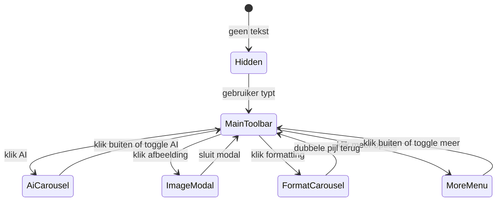

# Schrijfpagina: sticky toolbar met submenu's

## Status

- [x] Plan opgeslagen
- [x] Implementatie

## Uitgangspunt

De basis staat al in `components/journal/WritingArea.tsx`: hint + randloos textarea. Dit plan voegt een **sticky bottom toolbar** toe die zichtbaar wordt zodra `content.trim().length > 0`.

Formatting blijft **UI-only** (plain textarea blijft); knoppen tonen menu en hover-tekst, acties zijn mock/no-op.

## Visueel ontwerp

```
┌──────────────────────────────────────────────────────────┐
│  [AI hint tekst...]                                      │
│  [textarea — gebruiker typt hier]                        │
│                                                          │
│              ┌─────────────────────────┐                 │
│              │ [AI] [img] [Aa] [···]   │  ← sticky pill  │
│              └─────────────────────────┘                 │
└──────────────────────────────────────────────────────────┘
```

- **Positie**: `fixed bottom-6 left-1/2 -translate-x-1/2 z-20`
- **Vorm**: smalle pill — `rounded-full border border-lumina-500/25 bg-surface/90 backdrop-blur-sm px-3 py-2 shadow-sm`
- **Iconen**: klein (`h-8 w-8` knoppen, `h-4 w-4` svg), **enkelkleurig groen** — geen emoji's, geen multi-color SVG's
  - Standaard: `text-lumina-500`
  - Hover/actief: `text-lumina-700` of `text-foreground`
  - SVG's via `stroke="currentColor"` / `fill="currentColor"` zodat alles meekleurt met het Lumina-palet
- **Hover-tekst**: via `title` attribuut op elke knop (lichtgewicht, geen aparte tooltip-library)
- **Animatie**: fade-in/slide-up bij verschijnen (`opacity` + `translate-y`, CSS transition)
- **Padding onderaan pagina**: `pb-24` op schrijfsectie zodat tekst niet onder de toolbar verdwijnt

## Menu-staten



## Hoofd-toolbar (4 iconen)

| Icoon | Hover (`title`) | Actie |
|-------|-----------------|-------|
| AI/sparkle | Gebruik depth AI | Toont AI-carrousel |
| Afbeelding | Voeg afbeelding toe | Opent image modal |
| Aa / formatting | Verander style | Toont format-carrousel |
| drie puntjes | Meer opties | Toont meer-opties menu |

Bij open submenu vervangt de carrousel de hoofd-iconen in dezelfde pill (niet een tweede balk).

## Submenu: AI-carrousel

Horizontaal scrollbare rij iconen in de pill (patroon uit `DailyJournalCarousel.tsx`: `overflow-x-auto`, hidden scrollbar).

Items (elk als klein icoon-knop met `title`):

1. Vraag
2. Ga dieper
3. Coach me
4. Vat samen
5. Geef inzicht
6. Eerdere gedragspatronen
7. Actie punten
8. Geef feedback

Klik op item: mock-actie (geen echte AI). Klik opnieuw op AI-icoon of buiten de pill: terug naar hoofdmenu.

## Submenu: Formatting-carrousel

Zelfde carrousel-patroon. Items in volgorde:

1. dubbele pijl — **terug naar hoofdmenu** (`title`: "Terug")
2. Undo-pijl (`title`: "Ongedaan maken")
3. Redo-pijl (`title`: "Opnieuw")
4. Scheidingsteken (visueel `|`, geen knop)
5. Bold
6. Italic
7. Underline
8. Strike-through
9. Heading
10. Bullet list
11. Numbered list
12. Small caps
13. Title
14. Divider

Format-knoppen: visueel toggle-state mogelijk (`aria-pressed`), maar geen echte tekstopmaak op textarea.

## Afbeelding-modal

Popup naar patroon `AddGoalModal.tsx`:

- Overlay + `role="dialog"`, Escape sluit
- Titel: "Afbeelding toevoegen"
- `<input type="file" accept="image/*">` + drag-drop zone (visueel)
- Knoppen: Annuleren / Toevoegen (mock — geen upload)
- Nieuw bestand: `components/journal/ImageUploadModal.tsx`

## Meer opties

Compact popover boven de toolbar (of inline in pill als 3 iconen):

| Actie | Icoon | Mock-gedrag |
|-------|-------|-------------|
| Entry verwijderen | prullenbak | bevestigingsdialoog (optioneel) of direct reset textarea |
| Bookmarken | bookmark | toggle visuele state |
| Privé maken | slot/lock | toggle visuele state |

## Component-structuur

```
components/journal/
  WritingArea.tsx          ← uitbreiden: content state, toolbar visibility
  WritingToolbar.tsx       ← sticky pill, panel-switching
  ToolbarIconButton.tsx    ← herbruikbaar icoon + title + aria-label
  ToolbarCarousel.tsx      ← horizontale scroll-rij voor submenu's
  ImageUploadModal.tsx     ← file picker modal
  WritingToolbarIcons.tsx  ← alle iconen monochroom groen, currentColor
```

## State in `WritingArea`

```tsx
const [content, setContent] = useState("");
const [activePanel, setActivePanel] = useState<"main" | "ai" | "format" | "more">("main");
const [isImageModalOpen, setIsImageModalOpen] = useState(false);
const [isBookmarked, setIsBookmarked] = useState(false);
const [isPrivate, setIsPrivate] = useState(false);

const showToolbar = content.trim().length > 0;
```

## Bestanden

| Actie | Bestand |
|-------|---------|
| Nieuw | `components/journal/ToolbarIconButton.tsx` |
| Nieuw | `components/journal/ToolbarCarousel.tsx` |
| Nieuw | `components/journal/WritingToolbar.tsx` |
| Nieuw | `components/journal/ImageUploadModal.tsx` |
| Nieuw | `components/journal/WritingToolbarIcons.tsx` |
| Aanpassen | `components/journal/WritingArea.tsx` |

Geen wijzigingen aan `app/(app)/schrijf/page.tsx` nodig.

## Toegankelijkheid

- Elke icoon-knop: `aria-label` + `title` (hover)
- Carrousel: `role="toolbar"` op container
- Modal: `aria-modal`, focus trap, Escape
- Toolbar verschijnt: geen focus-steel (blijft in textarea)

## Scope (niet in deze stap)

- Geen echte AI-aanroepen
- Geen afbeelding-upload of opslag
- Geen rich-text / contenteditable
- Geen database voor bookmark/privé/delete

## Implementatie-todos

1. ToolbarIconButton, ToolbarCarousel, WritingToolbarIcons aanmaken
2. WritingToolbar met hoofdmenu + AI/format carrousels + meer-opties popover
3. ImageUploadModal (AddGoalModal-patroon, file input mock)
4. WritingArea: content state, showToolbar logica, toolbar + modal integreren
