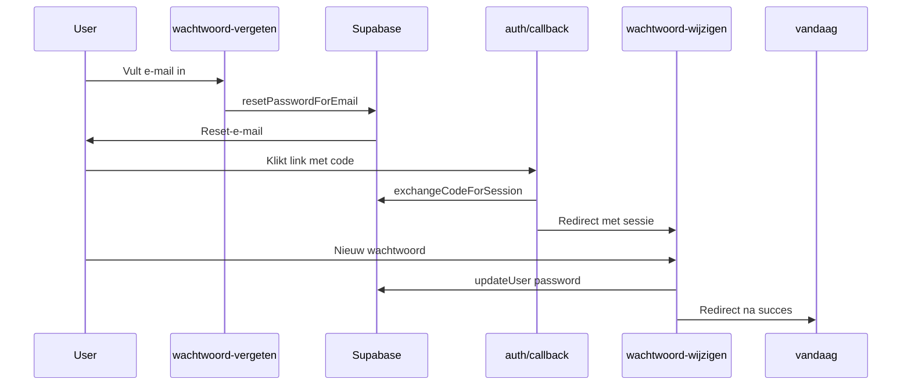
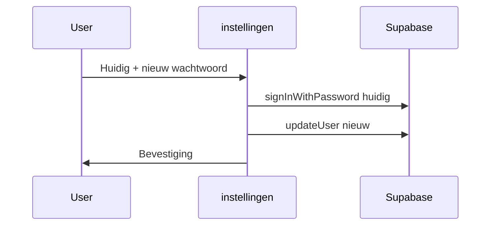

# Wachtwoord reset flow

## Overzicht

Implementeer de volledige Supabase wachtwoord-resetflow (vergeten → e-mail → nieuw wachtwoord) en voeg wachtwoord wijzigen toe in instellingen, in lijn met bestaande auth-patronen en Nederlandse UI-copy.

## Todos

- [x] `lib/auth/password.ts` met validatePassword en passwordsMatch
- [x] ForgotPasswordCard + wachtwoord-vergeten pagina met resetPasswordForEmail
- [x] auth/callback uitbreiden met next-param en foutafhandeling
- [x] ResetPasswordCard + /wachtwoord-wijzigen pagina met updateUser
- [x] ChangePasswordSection in ProfileForm (huidig + nieuw wachtwoord)
- [x] FooterGate + supabase/config.toml redirect URLs
- [ ] Lokaal testen via Inbucket en instellingen-flow verifiëren

## Huidige situatie

De basis staat al, maar de functionaliteit ontbreekt:

| Onderdeel | Status |
|-----------|--------|
| Link "Wachtwoord vergeten?" in [`LoginCard`](../../components/auth/LoginCard.tsx) | Klaar |
| Route `/wachtwoord-vergeten` in [`middleware.ts`](../../middleware.ts) | Klaar |
| Placeholder-pagina [`app/wachtwoord-vergeten/page.tsx`](../../app/wachtwoord-vergeten/page.tsx) | Vervangen door ForgotPasswordCard |
| Auth callback [`app/auth/callback/route.ts`](../../app/auth/callback/route.ts) | Uitgebreid met next-param |
| Instellingen [`ProfileForm`](../../components/settings/ProfileForm.tsx) | ChangePasswordSection toegevoegd |

## Gewenste flows

## Implementatiestappen

### 1. Gedeelde wachtwoordvalidatie

[`lib/auth/password.ts`](../../lib/auth/password.ts):

- `validatePassword(password: string): string | null` — minimaal 8 tekens
- `passwordsMatch(a: string, b: string): boolean`

### 2. Wachtwoord vergeten

[`components/auth/ForgotPasswordCard.tsx`](../../components/auth/ForgotPasswordCard.tsx) + [`app/wachtwoord-vergeten/page.tsx`](../../app/wachtwoord-vergeten/page.tsx)

### 3. Auth callback

[`app/auth/callback/route.ts`](../../app/auth/callback/route.ts) — next-param, foutafhandeling

### 4. Nieuw wachtwoord instellen

[`components/auth/ResetPasswordCard.tsx`](../../components/auth/ResetPasswordCard.tsx) + [`app/wachtwoord-wijzigen/page.tsx`](../../app/wachtwoord-wijzigen/page.tsx)

### 5. Wachtwoord wijzigen in instellingen

[`components/settings/ChangePasswordSection.tsx`](../../components/settings/ChangePasswordSection.tsx) in ProfileForm

### 6. Supabase-configuratie

Lokaal: [`supabase/config.toml`](../../supabase/config.toml) — redirect URLs

Productie: Supabase Dashboard → Authentication → URL Configuration

## Bestandenoverzicht

| Actie | Bestand |
|-------|---------|
| Nieuw | `lib/auth/password.ts` |
| Nieuw | `components/auth/ForgotPasswordCard.tsx` |
| Nieuw | `components/auth/ResetPasswordCard.tsx` |
| Nieuw | `components/settings/ChangePasswordSection.tsx` |
| Nieuw | `app/wachtwoord-wijzigen/page.tsx` |
| Wijzig | `app/wachtwoord-vergeten/page.tsx` |
| Wijzig | `app/auth/callback/route.ts` |
| Wijzig | `components/settings/ProfileForm.tsx` |
| Wijzig | `components/layout/FooterGate.tsx` |
| Wijzig | `supabase/config.toml` |

## Testplan

1. Lokaal forgot-flow via Inbucket
2. Verlopen link → foutmelding
3. Instellingen: wachtwoord wijzigen
4. Middleware: `/wachtwoord-wijzigen` zonder sessie → `/inloggen`
5. Productie: redirect URLs in Supabase dashboard

## Buiten scope

- OAuth / magic link
- Custom HTML e-mailtemplates in de repo
- Wachtwoordsterkte-meter bovenop 8 tekens
