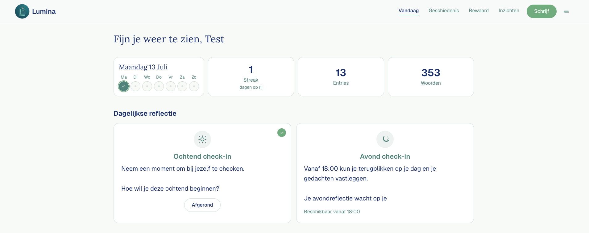
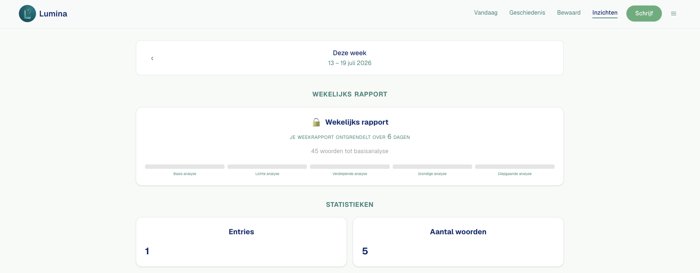

# Lumina

Lumina is a Dutch reflection-app that helps you write daily entries, let's you remember intentions and habits and add them, and receive AI-powered insights.






## Tech stack

- [Next.js 16] ([https://nextjs.org/](https://nextjs.org/)) (App Router)
- [React 19] ([https://react.dev/](https://react.dev/)) + TypeScript
- [Tailwind CSS 4] ([https://tailwindcss.com/](https://tailwindcss.com/))
- [Supabase] ([https://supabase.com](https://supabase.com)) (auth, database, storage)
- [OpenAI] ([https://openai.com/](https://openai.com/)) (AI coach, entry analysis, weekly reports)
- [Emotion Analysis API] ([https://rapidapi.com/twinword/api/emotion-analysis](https://rapidapi.com/twinword/api/emotion-analysis)) (Detecting emotions in a text: disgust, sadness, anger, joy, surprise, and fear)


## Prerequisites

- Node.js 20 or later
- A Supabase project
- An OpenAI API key
- An Emotion Analysis API plan


## Getting started


### 1. Clone and install

```bash
git clone git@github.com:tessavermeulen07/lumina.git
cd lumina
npm install
```


### 2. Environment variables

Copy the example file and fill in your values:

```bash
cp .env.example .env.local
```


| Variable                        | Required   | Description                                                         |
| ------------------------------- | ---------- | ------------------------------------------------------------------- |
| `NEXT_PUBLIC_SUPABASE_URL`      | Yes        | Supabase project API URL                                            |
| `NEXT_PUBLIC_SUPABASE_ANON_KEY` | Yes        | Supabase anonymous (public) key                                     |
| `SUPABASE_SECRET_KEY`           | Yes        | Supabase service role key (server-only, never expose to the client) |
|                                 |            |                                                                     |
| `OPENAI_API_KEY`                | Yes        | Invite code required for new user registration                      |
| `CRON_SECRET`                   | Production | Secret token for the daily check-in cron endpoint                   |
| `RAPIDAPI_KEY`                  | Optional   | RapidAPI key for TwinWord sentiment analysis                        |
| `TWINWORD_ENABLED`              | Optional   | Set to `false` to disable TwinWord                                  |
| `TWINWORD_MONTHLY_LIMIT`        | Optional   | Montly API call limit for TwinWord                                  |


> **Note:** `NEXT_PUBLIC_SUPABASE_URL` is the HTTP API URL for the app, not the database connection string. For migrations, use `SUPABASE_DB_URL` separately (Supabase Dashboard → Project Settings → Database → Connection string URI).


### 3. Database setup

Apply all migrations to your Supabase project:

```bash
npx supabase login
npx supabase link --project-ref <your-project-ref>
npx supabase db push
```

Verify the schema and Row Level Security:

```bash
npm run db:verify
npm run db:verify-rls
```


### 4. Run the development server

```bash
npm run dev
```

Open [http://localhost:3000](http://localhost:3000) in your browser.

## Project structure

```
src/
  app/              # Next.js routes and API
  components/
    ui/             # Reusable primitives
    layout/         # Shell, nav, providers
    features/       # Domain-specific UI
  hooks/            # Custom React hooks
  lib/              # Business logic and utilities
  types/            # TypeScript types
docs/               # Project brief, decisions, plans
supabase/           # Database migrations
public/             # Static assets
```

Available scripts


| command                      | Description                               |
| ---------------------------- | ----------------------------------------- |
| `npm run dev`                | Start the developer server                |
| `npm run build`              | Create a production build                 |
| `npm run start`              | Start the production server               |
| `npm run lint`               | Run ESLint                                |
| ```npm run db:migrate        | Apply the initial schema migration        |
| `npm run db:apply-questions` | Apply the questions table migration       |
| `npm run db:verify`          | Verify all required database tables exist |
| `npm run db:verify-rls`      | Verify Row Level Security policies        |


## Deployment

The app is configured for [Vercel] ([https://vercel.com/](https://vercel.com/)). A cron job runs daily at 05:00 UTC to process intention check-ins (`api/cron/check-ins`). Set `CRON_SECRET` in your production environment variables.

## Registration

New users need the invite code configured in `REGISTRATION_INVITE_CODE` to register.