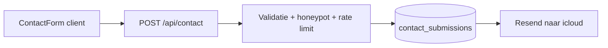

# Contact-pagina (Supabase + e-mailnotificatie)

## Keuze

- Pagina **`/contact`** in `(marketing)`, zelfde shell als privacy/voorwaarden/disclaimer: thin route + feature-component met `Header`, `main` `max-w-3xl`, `marketing-aura`.
- Formulier POST naar **`/api/contact`** (zelfde publieke-API-stijl als [register](src/app/api/auth/register/route.ts)).
- **Bron van waarheid:** insert in Supabase-tabel `contact_submissions` (service role; geen anon INSERT).
- **Notificatie:** na succesvolle insert mail via **Resend** naar `tessavermeulen@icloud.com` (geen e-mail-SDK in het project; Resend sluit aan bij bestaande plannen). DB-insert is verplicht; mail is best-effort (fout loggen, gebruiker ziet succes als opslag lukte).
- **Spam:** honeypot-veld (verborgen, bots vullen het) + server-side rate limit (IP, max ~5 requests / 15 min). Geen Captcha/Turnstile (houdt UX rustig, geen extra account).
- Footer Contact `#` → `/contact`. Legal pages: `mailto:privacy@lumina.app` → link naar `/contact`.

**Velden (alle verplicht):**

| Veld | Type |
|------|------|
| Voornaam | text |
| Achternaam | text |
| Emailadres | email |
| Onderwerp | text |
| Type | select: `Algemene vraag` \| `Support` \| `Klacht` |
| Bericht | textarea |

## Flow



## Bestanden

```
src/app/(marketing)/contact/page.tsx
src/components/features/marketing/ContactPage.tsx      # shell + copy
src/components/features/marketing/ContactForm.tsx      # client form
src/components/ui/Textarea.tsx                         # nieuw, stylt als Input
src/app/api/contact/route.ts
src/lib/contact/submit-contact.ts                      # parse/validate + insert + mail
src/lib/email/send-contact-notification.ts
supabase/migrations/<ts>_contact_submissions.sql
src/types/database.ts                                  # ContactSubmission types
src/components/layout/Footer.tsx                       # /contact
src/proxy.ts                                           # /contact, /api/contact (+ /disclaimer fix)
docs/plans/contact-pagina.md
```

Ook bijwerken (verwijzing i.p.v. e-mail):

- [docs/plans/privacy-pagina.md](docs/plans/privacy-pagina.md), [voorwaarden-pagina.md](docs/plans/voorwaarden-pagina.md), [disclaimer-pagina.md](docs/plans/disclaimer-pagina.md)
- [PrivacyPage.tsx](src/components/features/marketing/PrivacyPage.tsx), [TermsPage.tsx](src/components/features/marketing/TermsPage.tsx), [DisclaimerPage.tsx](src/components/features/marketing/DisclaimerPage.tsx)

## Database

Migratie `contact_submissions`:

- Kolommen: `id`, `first_name`, `last_name`, `email`, `subject`, `category` (`algemene_vraag` | `support` | `klacht`), `message`, `created_at`
- RLS aan; **geen** policies voor `anon`/`authenticated` → alleen service role schrijft/leest
- `GRANT` aan `service_role` (zelfde patroon als andere admin-only tabellen)

## API & validatie

- Zod (of zelfde stijl als [register.ts](src/lib/auth/register.ts)): trim, max lengths, e-mailformat, category enum, honeypot moet leeg zijn
- Rate limit: module-level Map op IP uit request headers (`x-forwarded-for` / `x-real-ip`)
- Insert via [createAdminClient](src/lib/supabase/admin.ts)
- Nederlandse foutmeldingen (`je`-vorm)

## E-mail

- Dependency: `resend`
- Env: `RESEND_API_KEY`, `CONTACT_NOTIFY_TO=tessavermeulen@icloud.com`, `CONTACT_FROM` (verified Resend-from, bijv. `Lumina <onboarding@resend.dev>` tijdens setup)
- Mail-inhoud: category, onderwerp, naam, reply-to = afzender-e-mail, berichttekst
- Documenteer keys in `.env.example`

## UI / UX

- Rustige marketingpagina: korte intro + formulier (geen drukke dashboard-look; formulier mag wel een lichte container hebben omdat het interactie is)
- Hergebruik `Input` / `Button`; native `<select>` gestyled consistent; nieuw `Textarea`
- Success-state na submit (“Bedankt, we hebben je bericht ontvangen.”); fouten inline
- Honeypot: visueel verborgen veld (`aria-hidden`, `tabIndex={-1}`, CSS off-screen) — niet `type="hidden"` alleen (sommige bots skippen die)

## Proxy & navigatie

In [proxy.ts](src/proxy.ts): voeg `/contact`, `/disclaimer`, en `pathname.startsWith("/api/contact")` toe aan publieke routes (disclaimer mist nu al in de set).

Footer: Contact → `Link href="/contact"`.

## Legal plannen & pagina’s

- Plannen: “Contact blijft `#` / mailto” → “Contact via `/contact`” (zie contact-plan); Contact uit “buiten scope” of markeren als apart plan.
- UI: alle `mailto:privacy@lumina.app` vervangen door `<Link href="/contact">contactpagina</Link>` (of vergelijkbare Nederlandse copy). Geen hardcoded `privacy@lumina.app` meer in die drie components.

## Buiten scope

- Contact in Header/mobile-nav
- Admin-UI om inzendingen te beheren
- Auto-reply naar de bezoeker
- Cloudflare Turnstile / reCAPTCHA
