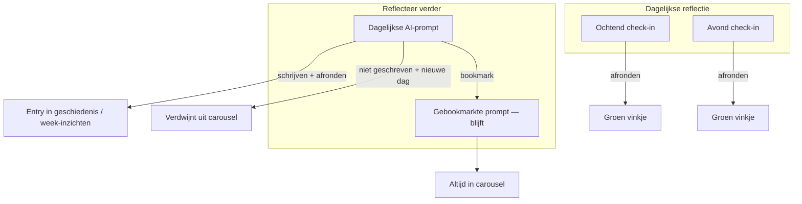

# Dagelijkse reflectie: ochtend/avond + Reflecteer verder

## Gewenste UX (samengevat)



**Vastgelegde keuzes:**
- Ochtend/avond check-in: groen vinkje na **afronden** op `/schrijf`
- Vervolgreflecties: **geen** groen vinkje — schrijven = gewone entry in geschiedenis, mee in week-inzichten
- Gebookmarkte vervolgreflecties: **blijven** in carousel (ook over dagen heen)
- Niet-gebookmarkte vervolgreflecties: verdwijnen na **afronden** gekoppeld aan die prompt, of bij **nieuwe dag** als ze niet zijn geschreven

---

## 1. Database

### Entries — check-in type

```sql
CREATE TYPE public.reflection_period AS ENUM ('ochtend', 'avond');
ALTER TABLE public.entries
  ADD COLUMN reflection_period public.reflection_period;
```

### Nieuwe tabel: `reflection_prompts`

Persistente opslag van vervolgreflecties per gebruiker:

```sql
CREATE TABLE public.reflection_prompts (
  id uuid PRIMARY KEY DEFAULT gen_random_uuid(),
  user_id uuid NOT NULL REFERENCES auth.users(id) ON DELETE CASCADE,
  topic text NOT NULL,
  question text NOT NULL,
  is_bookmarked boolean NOT NULL DEFAULT false,
  prompt_date date,
  entry_id uuid REFERENCES public.entries(id) ON DELETE SET NULL,
  bookmarked_at timestamptz,
  created_at timestamptz NOT NULL DEFAULT now()
);

CREATE INDEX reflection_prompts_user_bookmarked_idx
  ON public.reflection_prompts (user_id, is_bookmarked, bookmarked_at DESC);
CREATE INDEX reflection_prompts_user_date_idx
  ON public.reflection_prompts (user_id, prompt_date);
```

**Lifecycle-regels:**

| Status | Zichtbaar in carousel |
|--------|----------------------|
| `is_bookmarked = true` | Altijd |
| `prompt_date = vandaag` + `entry_id IS NULL` | Ja (dagelijkse prompt, nog niet geschreven) |
| `entry_id IS NOT NULL` + niet gebookmarkt | Nee (afgehandeld) |
| `prompt_date < vandaag` + niet gebookmarkt | Nee |

### Cache-tabel (ochtend/avond-context)

`dashboard_reflection_cache` blijft nuttig voor **ochtend/avond-context**. Primaire bron voor vervolgreflecties is `reflection_prompts`.

---

## 2. Data-laag `src/lib/dashboard/`

| Bestand | Rol |
|---------|-----|
| `get-reflection-completion.ts` | Ochtend/avond afgerond vandaag |
| `get-check-in-context.ts` | Context + hint voor check-in kaarten |
| `get-carousel-prompts.ts` | Merge bookmarked + open dagelijkse prompts |
| `ensure-daily-prompts.ts` | Genereert 2–3 AI-prompts als er nog geen rijen zijn voor `prompt_date = vandaag` |
| `reflection-cache.ts` | Cache voor ochtend/avond-context |

### `get-carousel-prompts.ts` query-logica

```sql
SELECT * FROM reflection_prompts
WHERE user_id = $1
  AND (
    is_bookmarked = true
    OR (prompt_date = $today AND entry_id IS NULL)
  )
ORDER BY is_bookmarked DESC, bookmarked_at DESC NULLS LAST, created_at ASC;
```

- Gebookmarkte prompts vooraan
- Maximaal **3 dagelijkse** + onbeperkt gebookmarkte (optioneel soft cap 15 bookmarks met NL-melding)

### `ensure-daily-prompts.ts`

- Bij page load `/vandaag`: als geen rijen met `prompt_date = vandaag` → roep [`generate-follow-up-prompts.ts`](src/lib/ai/generate-follow-up-prompts.ts) aan → INSERT 2–3 rijen
- **Niet** opnieuw genereren bij entry afronden
- Wel opnieuw genereren op **nieuwe kalenderdag** (automatisch via ontbrekende `prompt_date`-rijen)

---

## 3. Bookmark + afronden koppelen

### Server actions — `src/lib/dashboard/reflection-prompt-actions.ts`

| Action | Gedrag |
|--------|--------|
| `toggleBookmarkPrompt(id)` | Zet `is_bookmarked` + `bookmarked_at`; `revalidatePath('/vandaag')` |
| `linkPromptToEntry(promptId, entryId)` | Zet `entry_id` bij afronden (alleen als nog leeg) |

### UI op kaart — `FollowUpPromptCard.tsx` (nieuw, client)

Vervangt [`PromptCard.tsx`](src/components/features/dashboard/PromptCard.tsx):

- **Badge:** `topic` (thema uit AI)
- **Bookmark-knop** (rechtsboven, `aria-pressed`): roept `toggleBookmarkPrompt` aan; `e.stopPropagation()`
- **Kaartklik / potlood:** link naar `/schrijf?vervolg=<promptId>`
- **Geen** groen vinkje of overlay
- Gebookmarkte kaart: subtiel bookmark-icoon ingevuld (hergebruik patroon uit [`WritingToolbar.tsx`](src/components/features/journal/WritingToolbar.tsx))

### Schrijf-flow

[`schrijf/page.tsx`](src/app/(app)/schrijf/page.tsx):
- `?vervolg=<uuid>` → laad prompt-tekst als hint
- Geef `reflectionPromptId` door aan `WritingArea`

[`finalize-entry.ts`](src/lib/entries/finalize-entry.ts):
- Als `reflectionPromptId` meegegeven → `linkPromptToEntry(promptId, entryId)`
- `revalidatePath('/vandaag')` + `/inzichten`
- **Geen** cache-invalidatie voor dagelijkse prompts (entry verdwijnt uit carousel via `entry_id`)

Check-in flow (`?reflectie=ochtend|avond`) blijft apart met groen vinkje via `entries.reflection_period` + `entry_analyses`.

---

## 4. UI-structuur

[`DailyJournalSection.tsx`](src/components/features/dashboard/DailyJournalSection.tsx):

```
Dagelijkse reflectie          ‹ ›
[ Ochtend check-in ] [ Avond check-in ]     ← CheckInCard met groen vinkje

Reflecteer verder               ‹ ›
[ 🔖 Thema | vraag ] [ Thema | vraag ] ...  ← FollowUpPromptCard
```

[`vandaag/page.tsx`](src/app/(app)/vandaag/page.tsx):

```ts
await ensureDailyPrompts();
const [checkInData, carouselPrompts] = await Promise.all([
  getDailyCheckInData(),
  getCarouselPrompts(),
]);
```

---

## 5. AI-generatie

[`src/lib/ai/generate-follow-up-prompts.ts`](src/lib/ai/generate-follow-up-prompts.ts):
- Input: laatste 3–5 gefinaliseerde entries + `entry_analyses`
- Output: `{ prompts: [{ topic, question }] }`
- Resultaat → INSERT in `reflection_prompts`
- Fallback zonder entries: catalogus uit `questions`-tabel

### Ochtend/avond-context

- **Ochtend:** gisteren — meest recente gefinaliseerde entry met `entry_analyses`
- **Avond:** ochtend-entry vandaag → anders tussendoor geschreven vandaag → anders generiek
- Zelfde logica voor schrijfhint op `/schrijf?reflectie=ochtend|avond`

---

## 6. Scope-afbakening

- Bookmark op schrijf-toolbar ([`WritingArea`](src/components/features/journal/WritingArea.tsx)) blijft **lokaal/UI-only** — los van dashboard-bookmarks
- Geen groen vinkje op vervolgreflecties
- Toggle bookmark uit = prompt verdwijnt tenzij nog open dagelijkse prompt van vandaag
- **Buiten scope:** intentie-check-ins (fase 3), e-mailherinneringen

---

## Bestanden

| Actie | Bestand |
|-------|---------|
| Nieuw | `supabase/migrations/..._entry_reflection_period.sql` |
| Nieuw | `supabase/migrations/..._reflection_prompts.sql` |
| Nieuw | `supabase/migrations/..._dashboard_reflection_cache.sql` |
| Nieuw | `src/lib/dashboard/get-carousel-prompts.ts` |
| Nieuw | `src/lib/dashboard/ensure-daily-prompts.ts` |
| Nieuw | `src/lib/dashboard/reflection-prompt-actions.ts` |
| Nieuw | `src/lib/dashboard/get-reflection-completion.ts` |
| Nieuw | `src/lib/dashboard/get-check-in-context.ts` |
| Nieuw | `src/lib/dashboard/reflection-cache.ts` |
| Nieuw | `src/lib/ai/generate-follow-up-prompts.ts` |
| Nieuw | `src/components/features/dashboard/CheckInCard.tsx` |
| Nieuw | `src/components/features/dashboard/FollowUpPromptCard.tsx` |
| Wijzig | `src/components/features/dashboard/DailyJournalSection.tsx` |
| Wijzig | `src/app/(app)/vandaag/page.tsx` |
| Wijzig | `src/app/(app)/schrijf/page.tsx` |
| Wijzig | `src/components/features/journal/WritingArea.tsx` |
| Wijzig | `src/lib/entries/finalize-entry.ts` |
| Wijzig | `src/lib/entries/entry-blocks.ts` |
| Wijzig | `src/types/database.ts` |
| Verwijder/deprecate | `PromptCard.tsx` (vervangen door FollowUpPromptCard) |
