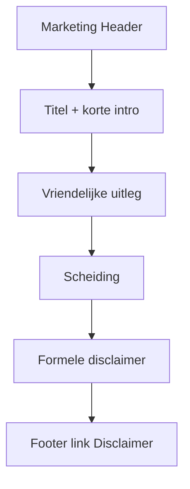

# Disclaimer-pagina

## Keuze

Zelfde patroon als [privacy](docs/plans/privacy-pagina.md) en [voorwaarden](docs/plans/voorwaarden-pagina.md):

1. Pagina **`/disclaimer`** met twee blokken (vriendelijk boven, formeel onder met anker `#disclaimer`)
2. Footer **Disclaimer** → `/disclaimer` in [`Footer.tsx`](src/components/layout/Footer.tsx)

Geen registratie-checkbox, geen in-app banners, geen cookie-banner. Contact via `/contact` (zie [contact-pagina](docs/plans/contact-pagina.md)).

**Inhoudelijke afbakening t.o.v. voorwaarden:** Voorwaarden regelen gebruik/akkoord; de disclaimer is expliciet over *grenzen van de dienst* — vooral AI/geen professioneel advies, geen zorgproduct, en beperkte aansprakelijkheid. Cross-links naar `/voorwaarden` en `/privacy` waar relevant; geen letterlijke duplicatie van hele voorwaarden.

## Route en bestanden

```
src/app/(marketing)/disclaimer/page.tsx              # thin page + metadata
src/components/features/marketing/DisclaimerPage.tsx
src/components/layout/Footer.tsx                     # href="/disclaimer"
docs/plans/disclaimer-pagina.md                      # plan opslaan
```

- Route group `(marketing)` → bestaande `marketing-aura` achtergrond.
- Server Component; geen client state.
- Layout/helpers kopiëren van [`TermsPage.tsx`](src/components/features/marketing/TermsPage.tsx) / [`PrivacyPage.tsx`](src/components/features/marketing/PrivacyPage.tsx): `Header`, `main` `max-w-3xl`, `SectionHeading` / `Paragraph` / `LegalHeading`, focus-visible links.
- Metadata: `title: "Disclaimer | Lumina"`, korte Nederlandse `description`.

## Layout / UX



## Inhoud

**Deel 1 — vriendelijk (je-vorm):**

- Wat deze pagina betekent (grenzen van Lumina)
- AI als hulpmiddel, geen therapie / medisch of psychologisch advies
- Portfolio- / eindopdrachtproject (geen commercieel zorgproduct)
- Inzichten kunnen onvolledig of onjuist zijn; jij blijft verantwoordelijk voor keuzes
- Bij ernstige klachten: passende hulp buiten Lumina zoeken
- Link naar `#disclaimer` + short links naar `/voorwaarden` en `/privacy`

**Deel 2 — formeel** (`id="disclaimer"`):

- Geen professioneel advies (medisch, psychologisch, juridisch)
- AI-uitvoer: geen garantie op juistheid; geen diagnoses
- Aard van de dienst (portfolio/eindopdracht, invite-only waar van toepassing)
- Beperkte aansprakelijkheid (realistisch voor dit project; aansluitend op voorwaarden § aansprakelijkheid)
- Externe diensten (OpenAI e.d.): hun fouten vallen buiten Lumina’s garantie
- Links: `/voorwaarden`, `/privacy`
- Contact: link naar `/contact` (geen e-mailadres op de pagina)
- Datum “laatst bijgewerkt” (bijv. 23 juli 2026)

Feitelijk houden — geen E2E-claim.

## Footer

In [`Footer.tsx`](src/components/layout/Footer.tsx): Disclaimer-`<a href="#">` vervangen door `<Link href="/disclaimer">` (zoals Privacy/Voorwaarden).

## Buiten scope

Cookie-banner, in-app AI-disclaimer-banner, opslaan van akkoord in de database.
