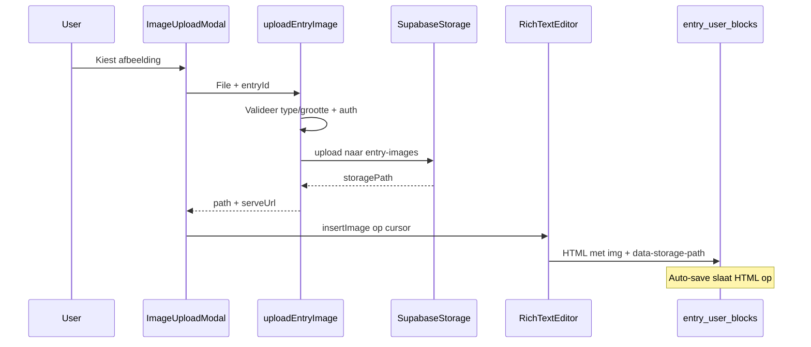

# Afbeelding toevoegen via Supabase Storage

## Status

- [x] Plan opgeslagen
- [ ] Implementatie

## Doel

Maak de bestaande image-modal werkend: upload naar een privé Supabase Storage bucket, sla het storage-pad op in de inline rich-text HTML, en toon afbeeldingen veilig in editor en geschiedenis via een geauthenticeerde serve-route.

**Plaatsing:** afbeelding inline in de entry-tekst (niet als apart bloktype).

## Uitgangspunt

- De toolbar-knop opent al [`ImageUploadModal.tsx`](src/components/features/journal/ImageUploadModal.tsx), maar die is **mock** (geen file handling, geen upload).
- Entries slaan user-tekst op als **HTML** in [`entry_user_blocks.content`](../../supabase/migrations/20250622120000_entry_user_blocks.sql) via de TipTap rich-text editor.
- Er is **nog geen** storage bucket of migratie in `supabase/migrations/`.

## Architectuur



**Opslag in HTML (stabiel, geen verlopende signed URLs in DB):**

```html

```

- `data-storage-path` = bron van waarheid in de database
- `src` = app-route die na auth een korte signed URL teruggeeft (redirect of stream)
- Bij opslaan HTML normaliseren zodat oude signed Supabase-URLs terug naar het app-pad gaan

## 1. Supabase Storage

Nieuwe migratie, bijv. `supabase/migrations/20250626120000_entry_images_storage.sql`:

- Bucket **`entry-images`**: `public = false`
- Limiet: **5 MB** per bestand
- MIME-types: `image/jpeg`, `image/png`, `image/webp`, `image/gif`
- RLS op `storage.objects`:
  - **INSERT**: pad begint met `auth.uid()::text`
  - **SELECT**: zelfde eigenaar-check (voor signed URL / download)
  - **DELETE**: zelfde eigenaar-check (voor opruimen bij entry verwijderen)

Padstructuur:

```
{user_id}/{entry_id}/{uuid}.{ext}
```

Optioneel in [`supabase/config.toml`](../../supabase/config.toml) lokale bucket-config spiegelen voor `supabase start`.

**Remote project:** migratie toepassen op Lumina Supabase (via bestaande `npm run db:migrate` flow of MCP `apply_migration`).

## 2. Upload server action

Nieuw: [`src/lib/entries/upload-entry-image.ts`](src/lib/entries/upload-entry-image.ts) (`"use server"`)

Input: `entryId`, `FormData` met `file`

Stappen:

1. Auth via [`src/lib/supabase/server.ts`](src/lib/supabase/server.ts)
2. Controleren dat `entryId` bij ingelogde user hoort (query op `entries`)
3. Valideren: bestand aanwezig, MIME-type whitelist, max 5 MB
4. `supabase.storage.from('entry-images').upload(path, file, { upsert: false, contentType })`
5. Retour: `{ storagePath, serveUrl }` waar `serveUrl = /api/entry-images/${storagePath}`

**Draft-entry zonder tekst:** als gebruiker alleen een afbeelding wil toevoegen vóór auto-save, roep in [`WritingArea.tsx`](src/components/features/journal/WritingArea.tsx) vóór upload `createEntryWithUserBlock('<p></p>')` aan (of kleine helper `ensureEntryDraft`) zodat `entryId` bestaat.

## 3. Afbeeldingen serveren (privé bucket)

Nieuw: [`src/app/api/entry-images/[...path]/route.ts`](src/app/api/entry-images/[...path]/route.ts)

- GET: parse pad `{userId}/{entryId}/{filename}`
- Auth + check dat `userId === auth.uid()` en entry van user is
- `createSignedUrl` (bijv. 1 uur) of `download` + `Response` met juiste `Content-Type`
- 404/403 bij ongeldig pad

Geen wijziging aan `next.config.ts` nodig als we gewone `` gebruiken.

## 4. Rich-text integratie

### TipTap Image extension

- Dependency: `@tiptap/extension-image`
- [`RichTextEditor.tsx`](src/components/features/journal/RichTextEditor.tsx): `Image.configure({ inline: false, allowBase64: false })`
- Prose-styling in [`rich-text-styles.ts`](src/lib/journal/rich-text-styles.ts): `[&_img]:my-4 [&_img]:max-w-full [&_img]:rounded-xl`

### EditorBridge

[`EditorBridge.tsx`](src/components/features/journal/EditorBridge.tsx): nieuwe methode `insertImage({ src, storagePath, alt? })`.

### ImageUploadModal

- File select + drag-and-drop
- Preview + upload state (`uploading`, fout in NL)
- Props: `entryId`, `onEnsureEntry`, `onImageInserted(src, storagePath)`, `onClose`

### WritingArea + toolbar

- Modal koppelen aan `entryId`, `ensureEntryDraft`, en `insertImage` via `EditorBridge`

## 5. HTML-normalisatie en weergave

Uitbreiden [`src/lib/utils/rich-text.ts`](src/lib/utils/rich-text.ts):

| Functie | Gedrag |
|---------|--------|
| `sanitizeRichTextHtml` | `img` toestaan met `src`, `alt`, `data-storage-path` |
| `stripRichTextToPlain` | afbeeldingen overslaan of `[afbeelding]` placeholder |
| `normalizeEntryImageHtml` | bij save: `src` altijd naar app-route op basis van `data-storage-path` |
| `resolveEntryImageHtml` | bij render: zorg dat `src` app-route is |

## 6. Opruimen bij verwijderen

Uitbreiden [`delete-entry.ts`](src/lib/entries/delete-entry.ts):

- Vóór DB-delete: storage-bestanden onder `{userId}/{entryId}/` verwijderen
- **Best-effort delete** — storage-fout blokkeert entry-delete niet

## Scope en grenzen

**In scope:**

- Eén afbeelding per upload-actie, inline in actief user-blok
- Upload, weergave in editor, auto-save, geschiedenis read-only
- Privé bucket met user-scoped RLS
- NL foutmeldingen

**Buiten scope (later):**

- Meerdere afbeeldingen tegelijk
- Afbeeldingen in AI-analyse / vision
- Orphan cleanup bij handmatig verwijderen uit editor
- Image compression/resize pipeline
- `isPrivate` toolbar-toggle koppelen aan storage policies

## Bestandenoverzicht

| Actie | Bestand |
|-------|---------|
| Nieuw | `supabase/migrations/20250626120000_entry_images_storage.sql` |
| Nieuw | `src/lib/entries/upload-entry-image.ts` |
| Nieuw | `src/lib/entries/ensure-entry-draft.ts` (optioneel) |
| Nieuw | `src/lib/utils/entry-images.ts` |
| Nieuw | `src/app/api/entry-images/[...path]/route.ts` |
| Wijzig | `src/components/features/journal/ImageUploadModal.tsx` |
| Wijzig | `src/components/features/journal/RichTextEditor.tsx` |
| Wijzig | `src/components/features/journal/EditorBridge.tsx` |
| Wijzig | `src/components/features/journal/WritingArea.tsx` |
| Wijzig | `src/lib/utils/rich-text.ts`, `src/lib/journal/rich-text-styles.ts` |
| Wijzig | `src/lib/entries/delete-entry.ts` |
| Wijzig | `package.json` (`@tiptap/extension-image`) |

## Testplan

1. **Upload:** kies JPEG/PNG → verschijnt inline in editor
2. **Zonder tekst:** alleen afbeelding uploaden → draft entry wordt aangemaakt
3. **Herladen:** `/schrijf?id=...` toont afbeelding opnieuw
4. **Geschiedenis:** Invoer-tab toont afbeelding read-only
5. **Beveiliging:** ander account kan vreemd pad niet openen
6. **Validatie:** PDF/te groot bestand → NL-fout in modal
7. **Verwijderen entry:** storage-bestanden weg
8. **AI/analyse:** plain-text extractie blijft werken

## Implementatie-todos

1. Supabase migratie: bucket `entry-images` + RLS policies
2. Server action `uploadEntryImage` + `ensureEntryDraft`
3. API route `/api/entry-images/[...path]`
4. TipTap Image extension, `EditorBridge.insertImage`, rich-text sanitize/normalize
5. `ImageUploadModal` + koppeling aan `WritingArea`
6. Storage opruimen in `delete-entry.ts`
7. Handmatig testen
