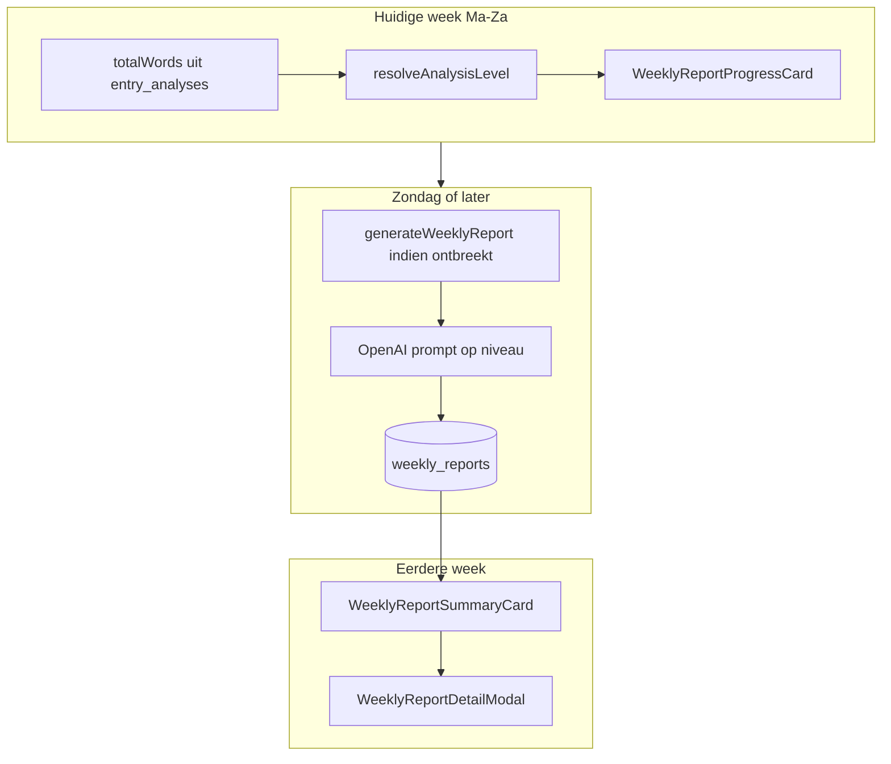

# Fase 2: Wekelijks rapport op Inzichten

Onderdeel van het overkoepelende plan: [vier-kernfeatures-afmaken.md](./vier-kernfeatures-afmaken.md)

Vervangt de emotietrend-aanpak uit [fase-2-emotietrends.md](./fase-2-emotietrends.md) qua prioriteit op `/inzichten`.

## Probleem

Fase 2 leverde [`EmotionTrendChart`](src/components/features/insights/EmotionTrendChart.tsx) bovenaan [`inzichten/page.tsx`](src/app/(app)/inzichten/page.tsx). Gewenst is daar een **wekelijks rapport** — vergelijkbaar met de statistieken-sectie — met:

- **Huidige week:** vergrendeld tot zondag, countdown in dagen, woorden tot volgend analyse-niveau, balk met 5 niveaus (basis → diepgaand), AI genereert automatisch op zondag op het bereikte niveau.
- **Eerdere weken:** één zin die uitspringt + datum in accentkleur; klikbaar → modal met titel, datum, optioneel badge "Diepgaand", en secties met tussenkopjes.

De Emotietrendgrafiek wordt **verwijderd**.

---

## Architectuur



Weekgrenzen blijven **maandag–zondag** via bestaande [`startOfWeek`](src/lib/data/week-utils.ts). "Ontgrendelt op zondag" = rapport wordt beschikbaar op de zondag (einde week) of wanneer de gebruiker daarna `/inzichten` bezoekt.

---

## Stap 1 — Analyse-niveaus (woordendrempels)

Nieuw [`src/lib/insights/analysis-levels.ts`](src/lib/insights/analysis-levels.ts):

| Niveau | Label | Min. woorden (week) |
|--------|-------|---------------------|
| 1 | Basis analyse | 50 |
| 2 | Lichte analyse | 150 |
| 3 | Verdiepende analyse | 300 |
| 4 | Grondige analyse | 500 |
| 5 | Diepgaande analyse | 750 |

Exports:

- `resolveAnalysisLevel(totalWords)` → `1 | 2 | 3 | 4 | 5 | null` (`null` = onder 50 woorden)
- `wordsToNextLevel(totalWords)` → `{ remaining: number; nextLevel: number } | null`
- `ANALYSIS_LEVEL_LABELS` voor UI-balk en badges
- `isWeekReportUnlocked(weekStart, now)` → `true` op zondag van die week of daarna
- `daysUntilReportUnlock(weekStart, now)` → aantal dagen tot zondag (0 op zondag)

Woordentelling hergebruikt `totalWords` uit [`get-weekly-insights.ts`](src/lib/insights/get-weekly-insights.ts) (som `entry_analyses.word_count` per week).

---

## Stap 2 — Database

Nieuwe migratie `weekly_reports`:

```sql
CREATE TABLE public.weekly_reports (
    id uuid PRIMARY KEY DEFAULT gen_random_uuid(),
    user_id uuid NOT NULL REFERENCES auth.users (id) ON DELETE CASCADE,
    week_start date NOT NULL,
    analysis_level smallint NOT NULL CHECK (analysis_level BETWEEN 1 AND 5),
    headline text NOT NULL,
    sections jsonb NOT NULL DEFAULT '[]',
    total_words int NOT NULL DEFAULT 0,
    generated_at timestamptz NOT NULL DEFAULT now(),
    UNIQUE (user_id, week_start)
);
```

`sections`: `[{ "title": "Emoties", "content": "..." }, ...]` — NL tussenkopjes + analyse-tekst.

RLS: zelfde patroon als `entry_analyses` (user mag alleen eigen rijen lezen; insert/update via server).

Types in [`src/types/database.ts`](src/types/database.ts) + `WeeklyReportSection` in `src/types/weekly-report.ts`.

**Niet** hergebruiken van `ai_insights` — die tabel is voor ad-hoc inzichten via Ask Lumina ([`save-insight.ts`](src/lib/ai/save-insight.ts)).

---

## Stap 3 — AI-generatie

Nieuw [`src/lib/ai/generate-weekly-report.ts`](src/lib/ai/generate-weekly-report.ts):

**Input:** `weekStart`, geaggregeerde weekdata (entry-samenvattingen, feelings, themes, persons, `totalWords`, `analysisLevel`).

**Prompt-gedrag per niveau:**

| Niveau | Output-diepte |
|--------|----------------|
| 1–2 | Korte headline + 2 secties (emoties, thema's) |
| 3–4 | Headline + 3–4 secties (emoties, thema's, personen, patronen) |
| 5 | Volledige analyse met 4–5 secties + rijkere reflectie per sectie |

Structured JSON output:

```ts
{ headline: string; sections: { title: string; content: string }[] }
```

**Trigger:** [`src/lib/insights/ensure-weekly-report.ts`](src/lib/insights/ensure-weekly-report.ts) — aangeroepen vanuit data-laag wanneer:

- week is ontgrendeld (`isWeekReportUnlocked`)
- `analysisLevel !== null` (min. 50 woorden)
- nog geen rij in `weekly_reports` voor die week

Idempotent: bestaand rapport niet opnieuw genereren (tenzij later expliciet gevraagd).

---

## Stap 4 — Data-laag

Nieuw [`src/lib/insights/get-weekly-report.ts`](src/lib/insights/get-weekly-report.ts):

```ts
export interface WeeklyReportView {
  weekStart: string;
  isUnlocked: boolean;
  daysUntilUnlock: number;
  totalWords: number;
  analysisLevel: number | null;
  wordsToNextLevel: number | null;
  nextLevelLabel: string | null;
  report: WeeklyReport | null; // null = nog niet gegenereerd of te weinig woorden
}
```

- Huidige week: altijd voortgangsdata; `report` alleen na unlock + generatie.
- Eerdere week: `ensureWeeklyReport` aanroepen indien ontgrendeld; retourneer `report` met headline voor teaser.

Aparte call in parallel met bestaande insights in [`inzichten/page.tsx`](src/app/(app)/inzichten/page.tsx) (scheiding van verantwoordelijkheden).

---

## Stap 5 — UI-componenten

Nieuwe sectie met heading [`insightsSectionHeadingClass`](src/components/features/insights/insights-styles.ts): **"wekelijks rapport"**.

### Huidige week — `WeeklyReportProgressCard`

Card in [`insightsCardClass`](src/components/features/insights/insights-styles.ts):

- Vergrendeld-icoon + tekst: "Je weekrapport ontgrendelt over **X dagen**" (of "vandaag" op zondag)
- Woorden tot volgend niveau: "Nog **N** woorden tot [volgend label]"
- **5 vlakjes** horizontaal: ingevuld tot huidig niveau, actief vlakje gemarkeerd (`bg-lumina-500`), labels onder of in tooltip (basis → diepgaand)
- Onder 50 woorden: "Schrijf minimaal 50 woorden deze week voor een basisanalyse"
- Op zondag na generatie: teaser-headline + link "Bekijk rapport" (zelfde modal als eerdere weken)

### Eerdere week — `WeeklyReportSummaryCard`

- Klikbare card: headline (één zin) als titel
- Datum (zondag / week-einde) in `text-lumina-500`
- Geen rapport (te weinig geschreven): rustige lege staat — "Deze week was er niet genoeg geschreven voor een rapport"

### Detail — `WeeklyReportDetailModal`

Modelleer op [`EntryDetailModal`](src/components/features/history/EntryDetailModal.tsx) (overlay, escape, focus):

- Titel = `headline`
- Datum in accentkleur
- Badge **"Diepgaande analyse"** als `analysis_level === 5`
- Kader met secties: `<h3>` tussenkopje + `<p>` inhoud per sectie

Client wrapper `WeeklyReportSection` kiest progress vs summary op basis van `isCurrentWeek`.

---

## Stap 6 — Pagina-layout

Wijzig [`src/app/(app)/inzichten/page.tsx`](src/app/(app)/inzichten/page.tsx):

```
1. InsightsWeekHeader
2. WeeklyReportSection          ← nieuw
3. InsightsStatisticsSection
4. Overzicht (EmotionalLandscape, ThemesGrid, PersonsCloud)
```

**Verwijderen:**

- [`EmotionTrendChart`](src/components/features/insights/EmotionTrendChart.tsx)
- [`get-emotion-trends.ts`](src/lib/insights/get-emotion-trends.ts)
- Import en call in page
- Optioneel: [`chart-axis.ts`](src/lib/insights/chart-axis.ts) als alleen door trend gebruikt — controleren en opruimen

---

## Stap 7 — Verificatie

1. **Huidige week (wo–za):** vergrendelde kaart, juiste dagen-countdown, balk op niveau 1–4, woorden-teller klopt
2. **Huidige week (zo):** rapport genereert (min. 50 woorden), headline zichtbaar
3. **Eerdere week:** één-zin-teaser + datum; klik opent modal met secties
4. **Niveau 5:** badge "Diepgaande analyse" in modal
5. **Te weinig woorden:** geen AI-call, duidelijke lege staat
6. `npm run build` — geen TypeScript-fouten

---

## Bestandenoverzicht

| Actie | Bestand |
|-------|---------|
| Nieuw | `src/lib/insights/analysis-levels.ts` |
| Nieuw | `supabase/migrations/..._weekly_reports.sql` |
| Nieuw | `src/types/weekly-report.ts` |
| Nieuw | `src/lib/ai/generate-weekly-report.ts` |
| Nieuw | `src/lib/insights/ensure-weekly-report.ts` |
| Nieuw | `src/lib/insights/get-weekly-report.ts` |
| Nieuw | `src/components/features/insights/WeeklyReportSection.tsx` |
| Nieuw | `src/components/features/insights/WeeklyReportProgressCard.tsx` |
| Nieuw | `src/components/features/insights/WeeklyReportSummaryCard.tsx` |
| Nieuw | `src/components/features/insights/WeeklyReportDetailModal.tsx` |
| Wijzig | `src/types/database.ts` |
| Wijzig | `src/app/(app)/inzichten/page.tsx` |
| Verwijder | `src/components/features/insights/EmotionTrendChart.tsx` |
| Verwijder | `src/lib/insights/get-emotion-trends.ts` |

---

## Buiten scope

- Cron-job voor generatie midden in de nacht (on-demand bij page load is voldoende voor MVP)
- Rapport opnieuw genereren na meer schrijven in dezelfde week
- E-mail met weekrapport
- Emotietrend over meerdere weken (bewust verwijderd)
