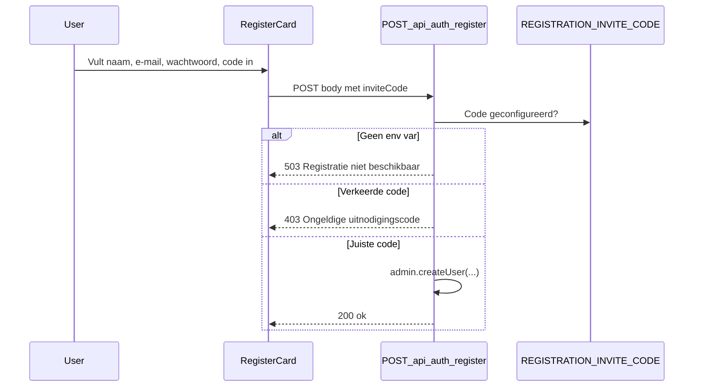

# Plan: gedeelde invite-code voor registratie (optie 1)

**Status:** geïmplementeerd

## Doel

Alleen mensen met de juiste code kunnen een account aanmaken. Zonder geconfigureerde code is registratie volledig geblokkeerd (fail-closed).

## Architectuur



## Wijzigingen

### 1. Environment variable

In `.env.example`:

```env
# Server-only: verplicht voor registratie; deel deze code met testers
REGISTRATION_INVITE_CODE=
```

- **Niet** `NEXT_PUBLIC_` — de code mag nooit naar de browser lekken als vaste waarde.
- Lokaal en op Vercel: zelfde variabele instellen met een sterk, willekeurig geheim (bijv. 16+ tekens).

### 2. Server-side validatie

In `lib/auth/register.ts`:

- `inviteCode` in `RegisterRequestBody` en `parseRegisterRequestBody`.
- `validateRegistrationInviteCode(submittedCode)`:
  - Leest `process.env.REGISTRATION_INVITE_CODE`.
  - Geen env var → 503 `"Registratie is tijdelijk niet beschikbaar."`
  - Lege code → 400 `"Vul je uitnodigingscode in."`
  - Vergelijking met `crypto.timingSafeEqual` (trim + dummy-buffer bij lengte-mismatch).
  - Foute code → 403 `"Ongeldige uitnodigingscode."`

In `app/api/auth/register/route.ts`:

- Na `parseRegisterRequestBody`, vóór `createUser`, invite-code valideren.

Volgorde: env-check service role → body parse → invite-code → user aanmaken.

### 3. UI: codeveld op registratieformulier

In `components/marketing/RegisterCard.tsx`:

- Veld **Uitnodigingscode** bovenaan het formulier.
- `inviteCode` meesturen in POST body naar `/api/auth/register`.

### 4. URL prefill

In `RegisterCard.tsx`:

- Bij mount: `?code=...` uit de URL lezen en het veld vooraf invullen.

Voorbeeld: `https://jouwdomein.nl/registreren?code=JOUW-CODE`

### 5. Geen wijzigingen nodig (bewust)

| Onderdeel | Reden |
|-----------|--------|
| `middleware.ts` | `/registreren` blijft publiek; beveiliging zit in de API |
| Marketing CTA's | Pagina blijft vindbaar; zonder code lukt registratie niet |
| Supabase `enable_signup` | Route gebruikt `admin.createUser` via service role |
| Database migration | Niet nodig voor optie 1 |

## Beveiliging

- Validatie **alleen server-side**.
- Generieke foutmelding bij verkeerde code.
- Code nooit loggen of in error responses echoën.

## Testplan

1. Zonder env var → POST `/api/auth/register` → 503.
2. Met env var, lege/verkeerde code → 400/403.
3. Met juiste code → account + inloggen + onboarding.
4. URL prefill → `/registreren?code=...` vult het veld in.
5. Direct API-aanroep zonder code → geblokkeerd.

## Scope-bewust

Eén gedeelde code voor alle testers. Bij lek: env var wijzigen en redeployen. Voor eenmalige of per-persoon codes: later optie 2 (database-tabel).

## Supabase

Supabase heeft **geen ingebouwde beta-/invite-code** voor zelf-registratie. De code hoort in de app (`REGISTRATION_INVITE_CODE` + API-check), niet in het Supabase-dashboard.

| Supabase-optie | Past bij deze setup? |
|----------------|----------------------|
| Disable sign-ups | Niet voldoende alleen — `admin.createUser` omzeilt dit |
| Invite by email | Ander model (per e-mail, geen gedeelde code) |
| Captcha | Aanvullend |
| Codes in database | Optie 2 |

**Configuratie:**

- Lokaal: `.env.local` → `REGISTRATION_INVITE_CODE=...`
- Productie: Vercel Environment Variables

## Code-formaat

Willekeurige geheime string, minimaal 12–16 tekens, case-sensitive.

```bash
openssl rand -hex 16
```

Delen met testers: code zelf, of `/registreren?code=JOUW-CODE`.
