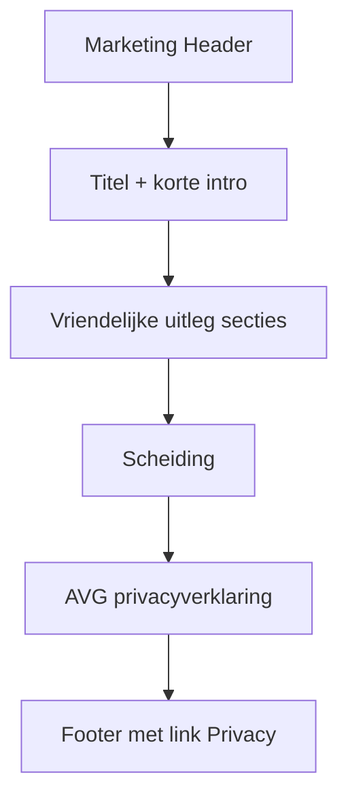

# Privacy-pagina (uitleg + AVG)

## Keuze

Eén pagina op **`/privacy`** met twee blokken:

1. **Vriendelijke uitleg** (boven) — rustig, Nederlands met **je**, producttaal
2. **Privacyverklaring (AVG)** (onder) — formeel, maar leesbaar; met anker `#privacyverklaring`

Alleen Privacy is in scope. Contact via `/contact` (zie [contact-pagina](docs/plans/contact-pagina.md)).

## Route en bestanden

```
src/app/(marketing)/privacy/page.tsx          # thin page + metadata
src/components/features/marketing/PrivacyPage.tsx
docs/plans/privacy-pagina.md                  # plan opslaan
```

- Blijft in route group `(marketing)` → `marketing-aura` achtergrond.
- Server Component; geen client state.
- Footer: Privacy `href="/privacy"` in `Footer.tsx`.

## Layout / UX



- Hergebruik Header. Nav-ankers: `/#functies`, `/#over-ons`, `/#prijzen`.
- Content in `main`: max-width ~`max-w-3xl`, rustige typografie.
- Metadata: `title: "Privacy | Lumina"`.

## Inhoud — deel 1: vriendelijke uitleg

Feitelijk (geen E2E-claim). Secties: jouw reflecties, wat we nodig hebben, AI als hulpmiddel, privé-entries, wat we niet doen, jouw keuzes. Link naar `#privacyverklaring`.

## Inhoud — deel 2: AVG-privacyverklaring

Verantwoordelijke, gegevens, doeleinden, bewaartermijn (30 dagen na accountverwijdering), verwerkers (Supabase, OpenAI, TwinWord/RapidAPI, Vercel), doorgifte buiten EER, beveiliging, rechten, wijzigingen.

## Footer en navigatie

- Footer Privacy → `/privacy`
- Header-ankers met prefix `/`

## Buiten scope

Voorwaarden, Disclaimer, cookie-banner, account-verwijderflow, registratie-E2E-copy.
