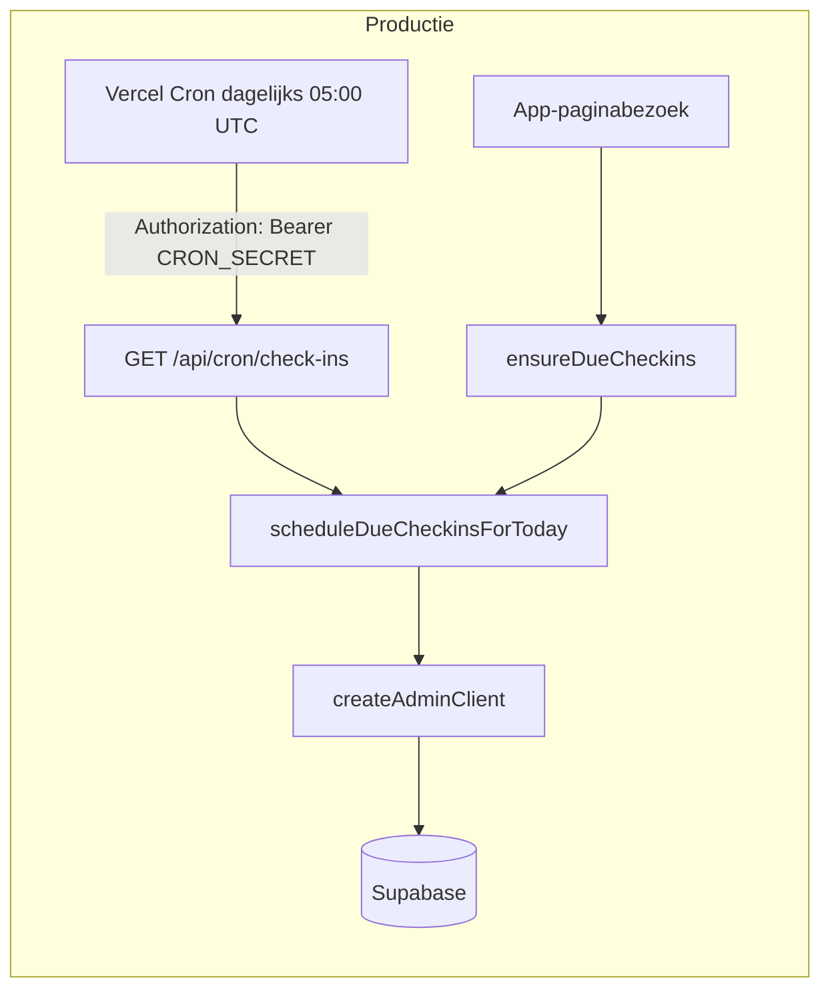

# Productie: cron scheduler werkend krijgen

## Context

De scheduler vult de in-app check-in inbox (`intention_checkin_queue`), per gebruiker op basis van `profiles.timezone`. Gebruikers zien daardoor open doelen op **Vandaag** — zonder push of e-mail.



**Hybrid scheduling (Vercel Hobby):**

| Trigger | Wanneer |
|---------|---------|
| [`ensureDueCheckins`](src/lib/habits/ensure-due-checkins.ts) | Bij elk app-paginabezoek (dev + productie) |
| Vercel cron via [`vercel.json`](../../vercel.json) | Dagelijks 05:00 UTC — vangnet voor inactieve gebruikers |

Uurlijkse cron vereist Vercel Pro; timezone-awareness voor actieve gebruikers loopt via `ensureDueCheckins`.

**Bugfix (middleware):** `/api/cron/*` moet publiek bereikbaar zijn (auth via `CRON_SECRET`, niet via sessie). Zie [`src/middleware.ts`](../../src/middleware.ts).

## Vereiste environment variables (Vercel → Production)

| Variabele | Waarom nodig |
|-----------|--------------|
| `CRON_SECRET` | Vercel stuurt bij elke cron-hit `Authorization: Bearer <CRON_SECRET>`. Zonder deze var geeft de route altijd **503** (na codewijziging) of **401**. |
| `SUPABASE_SERVICE_ROLE_KEY` **of** `SUPABASE_SECRET_KEY` | [`createAdminClient`](src/lib/supabase/admin.ts) gooit anders → cron **500**. |
| `NEXT_PUBLIC_SUPABASE_URL` | Nodig voor de admin client. |

**Naamgeving:** lokaal staat `SUPABASE_SECRET_KEY` in `.env.local`; de code accepteert beide namen. Gebruik in Vercel dezelfde naam als al voor registratie.

## Stappen (operations)

### 1. `CRON_SECRET` aanmaken en in Vercel zetten

1. Genereer een sterk geheim (min. 32 tekens), bijv. `openssl rand -base64 32`.
2. Vercel Dashboard → project Lumina → **Settings → Environment Variables**.
3. Voeg toe: `CRON_SECRET` → alleen **Production**.
4. **Redeploy** production.

### 2. Service role key controleren

Controleer `SUPABASE_SECRET_KEY` of `SUPABASE_SERVICE_ROLE_KEY` in Vercel Production tegen Supabase Dashboard → API keys.

### 3. Verificatie na deploy

```bash
curl -sS -H "Authorization: Bearer <CRON_SECRET>" \
  "https://<productie-domein>/api/cron/check-ins"
```

Verwacht **200** met `{ "success": true, ... }`.

## Buiten scope

- Geen push-notificaties
- Geen e-mail / Resend

Zie [timezone-aware-cron.md](timezone-aware-cron.md) voor de timezone-aware scheduler-implementatie.

## Acceptatiecriteria

1. `CRON_SECRET` in Vercel Production + redeploy
2. Service role key in Vercel Production
3. Handmatige curl geeft 200
4. Gebruikers krijgen in-app check-ins op hun lokale dag
5. Push/mail niet toegevoegd
