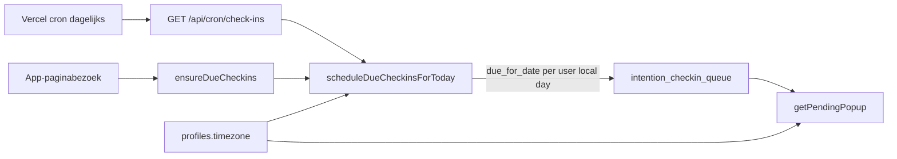

# Plan: timezone-aware cron voor doelen-check-ins

## Status: geïmplementeerd

Zie [`src/lib/utils/user-timezone.ts`](src/lib/utils/user-timezone.ts), [`src/lib/habits/schedule-due-checkins.ts`](src/lib/habits/schedule-due-checkins.ts) en migratie [`supabase/migrations/20260713130000_profile_timezone.sql`](../../supabase/migrations/20260713130000_profile_timezone.sql).

## Doelarchitectuur

**Kernprincipe:** `due_for_date` = kalenderdag in de timezone van de gebruiker. Scheduler is **idempotent**. Actieve gebruikers worden bij app-bezoek gepland; dagelijkse cron is vangnet (Vercel Hobby = max 1×/dag).

## Handmatig testen

1. Draai migratie `20260713130000_profile_timezone.sql` op Supabase.
2. Zet een testprofiel op `America/Los_Angeles`.
3. Trigger cron: `curl -sS -H "Authorization: Bearer <CRON_SECRET>" https://<domein>/api/cron/check-ins`
4. Controleer `intention_checkin_queue.due_for_date` = lokale LA-datum.
5. Herhaal run → `duplicatesSkipped` stijgt, geen dubbele rijen.

## Eindopdracht-formulering

"Intenties met timezone-aware, getimede in-app check-ins en een hybrid productie-scheduler (dagelijkse cron + scheduling bij app-bezoek)."
