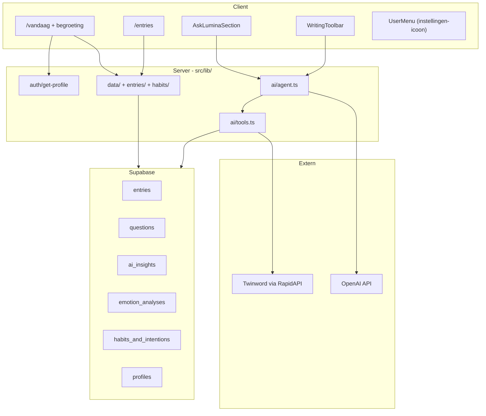

# Plan: gebruikerskoppeling + Ask Lumina AI

## Huidige situatie (na implementatie)

| Onderdeel | Status |
|-----------|--------|
| Routebescherming + entry opslaan | Supabase Auth + RLS |
| Dashboard (`/vandaag`) | Echte entry-data + begroeting "Fijn je weer te zien, {naam}" |
| Entries (`/entries`) | Lijst + bewerken via `/schrijf?id=…` |
| Intenties | Persistent in `habits_and_intentions` |
| Ask Lumina | OpenAI-agent + DB-vragen + recente `ai_insights` |
| UserMenu | Instellingen-icoon + dropdown (Instellingen, Uitloggen) |
| Schrijf-toolbar AI | `respondToEntryAction` + `AiResponsePanel` |
| Instellingen | Profiel, coach-stijl, uitloggen |
| AI-backend | `src/lib/ai/agent.ts`, tools, Twinword, journal search |

De database gebruikt bestaande tabellen: `profiles`, `entries`, `emotion_analyses`, `habits_and_intentions`, `ai_insights`, `questions`. FTS-kolom via [`supabase/migrations/20250622100000_entries_fts.sql`](supabase/migrations/20250622100000_entries_fts.sql).

## Architectuur



---

## Fase 1 — Gedeelde data-laag en profiel

### 1.1 Profiel ophalen

[`src/lib/auth/get-profile.ts`](src/lib/auth/get-profile.ts)

- `getAuthenticatedUser()` — `createClient()` + `getUser()`, redirect naar `/inloggen` als niet ingelogd
- `getProfile()` — `profiles` row + e-mail uit auth

### 1.2 Instellingenmenu in de header (icoon, geen naam)

[`src/components/layout/UserMenu.tsx`](src/components/layout/UserMenu.tsx) + [`src/components/layout/SettingsIcon.tsx`](src/components/layout/SettingsIcon.tsx)

- Trigger: **instellingen-icoon** (tandwiel), `aria-label`: "Instellingen en account"
- Dropdown: **Instellingen** + **Uitloggen**
- Uitloggen: `signOut()` → `/inloggen` → `router.refresh()`

[`src/app/(app)/layout.tsx`](src/app/(app)/layout.tsx) — geen profiel-fetch; naam alleen op dashboard.

---

## Fase 2 — Dashboard aan echte entries + persoonlijke begroeting

### 2.1 Begroeting

[`src/components/features/dashboard/DashboardGreeting.tsx`](src/components/features/dashboard/DashboardGreeting.tsx) — **"Fijn je weer te zien, {username}"** boven `DashboardOverview`.

### 2.2 Entry-statistieken

[`src/lib/data/get-dashboard-overview.ts`](src/lib/data/get-dashboard-overview.ts) + [`src/lib/data/week-utils.ts`](src/lib/data/week-utils.ts)

| Stat | Berekening |
|------|------------|
| `weekDays[].hasEntry` | Unieke datums in huidige week (ma–zo) |
| `entryCount` | `COUNT(*)` |
| `wordCount` | Woorden in `content` |
| `streak` | Opeenvolgende dagen met entry; start vanaf gisteren als vandaag leeg |

[`src/app/(app)/vandaag/page.tsx`](src/app/(app)/vandaag/page.tsx) — parallel fetch: profiel, overview, journal prompts, intenties, Lumina-vragen, recente inzichten.

[`src/lib/mock/dashboard.ts`](src/lib/mock/dashboard.ts) — verwijderd.

---

## Fase 3 — Entries lezen en bewerken

| Bestand | Functie |
|---------|---------|
| [`src/lib/entries/list-entries.ts`](src/lib/entries/list-entries.ts) | Lijst entries |
| [`src/lib/entries/get-entry.ts`](src/lib/entries/get-entry.ts) | Enkele entry |

UI: [`src/components/features/entries/EntryList.tsx`](src/components/features/entries/EntryList.tsx), [`EntryCard.tsx`](src/components/features/entries/EntryCard.tsx), [`schrijf/page.tsx`](src/app/(app)/schrijf/page.tsx) met `?id=`, [`WritingArea`](src/components/features/journal/WritingArea.tsx) met `initialContent` / `initialEntryId`.

---

## Fase 4 — Intenties persistent

[`src/lib/habits/`](src/lib/habits/) — `listIntentions`, `saveIntention`, `deleteIntention` (soft-delete `is_active = false`).

[`GoalsSection`](src/components/features/dashboard/GoalsSection.tsx) — server-fetched `initialGoals` + server actions.

---

## Fase 5 — Ask Lumina AI

### Database

[`supabase/migrations/20250622100000_entries_fts.sql`](supabase/migrations/20250622100000_entries_fts.sql) — `search_vector` + GIN-index.

[`questions`](supabase/migrations/20250622000000_questions.sql) — via `npm run db:apply-questions`.

### Omgevingsvariabelen

```
OPENAI_API_KEY=...
RAPIDAPI_KEY=...
```

### AI-stack

| Bestand | Rol |
|---------|-----|
| [`src/lib/ai/twinword.ts`](src/lib/ai/twinword.ts) | `analyze_entry_sentiment` |
| [`src/lib/ai/search-journal.ts`](src/lib/ai/search-journal.ts) | `search_journal_history` |
| [`src/lib/ai/save-insight.ts`](src/lib/ai/save-insight.ts) | `save_ai_insight` |
| [`src/lib/ai/tools.ts`](src/lib/ai/tools.ts) | Tool-definities + executors |
| [`src/lib/ai/agent.ts`](src/lib/ai/agent.ts) | OpenAI GPT-4o-mini tool-calling |
| [`src/lib/ai/ask-lumina.ts`](src/lib/ai/ask-lumina.ts) | Server action dashboard |
| [`src/lib/ai/get-recent-insights.ts`](src/lib/ai/get-recent-insights.ts) | Recente inzichten |

[`AskLuminaSection`](src/components/features/dashboard/AskLuminaSection.tsx) — DB-vragen, eigen vraag, AI-antwoord, recente inzichten.

---

## Fase 6 — Schrijf-toolbar AI

[`src/lib/ai/respond-to-entry.ts`](src/lib/ai/respond-to-entry.ts) + [`src/lib/ai/toolbar-actions.ts`](src/lib/ai/toolbar-actions.ts)

[`WritingToolbar`](src/components/features/journal/WritingToolbar.tsx) — `onAiAction`  
[`AiResponsePanel`](src/components/features/journal/AiResponsePanel.tsx) — antwoord onder editor

---

## Fase 7 — Instellingen

[`src/app/(app)/instellingen/page.tsx`](src/app/(app)/instellingen/page.tsx) + [`ProfileForm`](src/components/features/settings/ProfileForm.tsx) + [`src/lib/profile/update-profile.ts`](src/lib/profile/update-profile.ts)

- Naam bewerken, e-mail read-only, AI-coach stijl, uitlogknop

---

## Afhankelijkheden

```bash
npm install openai
```

---

## Testplan

1. Uitloggen via instellingen-icoon → `/inloggen`; `/vandaag` geblokkeerd
2. Dashboardbegroeting met juiste `profiles.username`
3. Dashboard stats kloppen na schrijven op meerdere dagen
4. Entries-lijst + bewerken via `/schrijf?id=…`
5. Intenties persistent per gebruiker
6. Ask Lumina → NL-antwoord + `ai_insights` rij
7. Twinword emotiescores bij relevante tekst
8. Journal search vindt eerdere entries
9. Toolbar AI op schrijfpagina
10. Username wijzigen in instellingen → begroeting update
11. `npm run db:verify-rls`

---

## Bewust buiten scope

- pgvector / embeddings
- `habit_logs` check-ins
- Onboarding-antwoorden uit `sessionStorage` naar profiel
- Wachtwoord wijzigen / account verwijderen
- Emotie-analyse automatisch bij elke save

---

## Status

- [x] Code geïmplementeerd; `npm run build` slaagt
- [ ] Migraties op remote DB (`npm run db:migrate`, `npm run db:apply-questions`) — vereist `SUPABASE_DB_URL`
- [ ] `OPENAI_API_KEY` en `RAPIDAPI_KEY` in `.env.local`
- [ ] Handmatig testen volgens testplan
