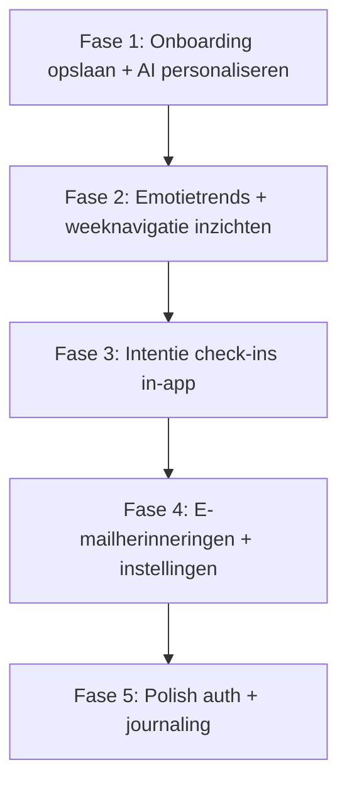

# Plan: vier kernfeatures volledig afdekken

Zie [fase-1-onboarding.md](./fase-1-onboarding.md) voor het uitgewerkte implementatieplan van fase 1.

## Huidige stand (kort)

| Feature | Dekking | Grootste gat |
|---------|---------|--------------|
| Auth & onboarding | ~75% | Alleen `coachStyle` in DB; rest in sessionStorage |
| Journaling + AI-coach | ~85% | AI op aanvraag (toolbar), niet proactief live |
| Intenties & check-ins | ~20% | `habit_logs` ongebruikt; geen herinneringen |
| Emotion dashboard | ~60% | Week-snapshot, geen trends over tijd |

---

## Aanbevolen volgorde

Fase 1 en 2 zijn relatief klein en leveren direct zichtbare waarde voor je eindopdracht-demo. Fase 3–4 vullen het grootste functionele gat. Fase 5 is optionele polish.

---

## Fase 1 — Onboarding volledig koppelen aan personalisatie

**Uitgewerkt plan:** [fase-1-onboarding.md](./fase-1-onboarding.md)

**Probleem:** [`complete-onboarding.ts`](src/lib/profile/complete-onboarding.ts) slaat alleen `ai_persona_preference` op; `mainGoal`, `priorities` en `experience` verdwijnen in sessionStorage ([`OnboardingWizard.tsx`](src/components/features/onboarding/OnboardingWizard.tsx)).

**Database-migratie** (nieuw bestand in `supabase/migrations/`):

- Voeg kolommen toe aan `profiles`:
  - `onboarding_main_goal text`
  - `onboarding_priorities jsonb` (array van priority-ids)
  - `onboarding_experience text`
  - `onboarding_completed_at timestamptz`
- Update [`src/types/database.ts`](src/types/database.ts) `Profile`-interface.

**Opslag:**

- Breid [`complete-onboarding.ts`](src/lib/profile/complete-onboarding.ts) uit: ontvang volledige `OnboardingAnswers`, schrijf alle velden + `onboarding_completed_at`.
- Pas [`OnboardingWizard.tsx`](src/components/features/onboarding/OnboardingWizard.tsx) aan: geef `finalAnswers` door i.p.v. alleen `coachStyle`.

**AI-personalisatie:**

- Breid `buildSystemPrompt` in [`agent-prompt.ts`](src/lib/ai/agent-prompt.ts) uit met optionele `onboardingContext` (hoofddoel, prioriteiten, ervaring) — korte NL-contextblokken, geen lange prompts.
- Laad profielvelden in [`respond-to-entry.ts`](src/lib/ai/respond-to-entry.ts) en [`ask-lumina.ts`](src/lib/ai/ask-lumina.ts) en geef door aan `runLuminaAgent`.

**Onboarding afdwingen:**

- In [`src/app/(app)/layout.tsx`](src/app/(app)/layout.tsx): als ingelogde user `onboarding_completed_at` mist → redirect naar `/onboarding` (behalve `/onboarding` zelf en auth-routes).

---

## Fase 2 — Emotion Analytics: trends over tijd

**Probleem:** [`inzichten/page.tsx`](src/app/(app)/inzichten/page.tsx) roept `getWeeklyInsights()` aan zonder week-parameter; [`EmotionalLandscape.tsx`](src/components/features/insights/EmotionalLandscape.tsx) toont alleen een week-snapshot.

**Weeknavigatie (hergebruik patroon van geschiedenis):**

- Voeg `searchParams.week` toe aan [`inzichten/page.tsx`](src/app/(app)/inzichten/page.tsx).
- Geef `weekStartParam` door aan bestaande [`getWeeklyInsights`](src/lib/insights/get-weekly-insights.ts) (ondersteunt dit al).
- Nieuwe client-component `InsightsWeekHeader` — kopieer navigatielogica uit [`HistoryWeekHeader.tsx`](src/components/features/history/HistoryWeekHeader.tsx) / [`GeschiedenisView.tsx`](src/components/features/history/GeschiedenisView.tsx).

**Emotietrends (nieuw):**

- Nieuw `src/lib/insights/get-emotion-trends.ts`:
  - Query `emotion_analyses` via join op `entries` voor de ingelogde user.
  - Aggregeer per week (laatste 8–12 weken): gemiddelde scores per emotie (`joy`, `fear`, `sadness`, `anger`, `surprise`, `disgust`).
  - Hergebruik `startOfWeek` uit [`week-utils.ts`](src/lib/data/week-utils.ts).
- Nieuw `src/components/features/insights/EmotionTrendChart.tsx`:
  - Zelfde CSS-bar/lijn-aanpak als [`WordsPerDayChart.tsx`](src/components/features/insights/WordsPerDayChart.tsx) — **geen nieuwe chart-library** (project heeft geen recharts/d3).
  - Toon 2–3 belangrijkste emoties als lijn/sparkline of gestapelde weekbalken; rustige Lumina-styling.
- Plaats trendgrafiek boven `EmotionalLandscape` op `/inzichten`.

**TwinWord-koppeling:** Geen extra API-werk nodig — scores komen al binnen via [`finalize-entry.ts`](src/lib/entries/finalize-entry.ts) → `emotion_analyses`.

---

## Fase 3 — Intenties & check-ins (in-app)

**Probleem:** [`GoalsSection.tsx`](src/components/features/dashboard/GoalsSection.tsx) is CRUD-only; `habit_logs` bestaat in schema maar wordt nergens gebruikt.

**Data-laag (nieuw in `src/lib/habits/`):**

| Functie | Doel |
|---------|------|
| `get-intention-status.ts` | Per intentie: laatste log, of vandaag/deze week "due" is (op basis van `frequency`) |
| `log-intention-checkin.ts` | Insert in `habit_logs` met status `completed` / `skipped` |
| `generate-intention-checkin.ts` | Server action: AI-prompt op basis van intentie + recente entries |

**AI check-in prompt:**

- Nieuw `src/lib/ai/intention-checkin.ts`: korte `runLuminaAgent`-call met `interactionMode: "dashboard"`, intentie-context, optioneel `search_journal_history`.
- Sla gegenereerde vraag op in `habit_logs.ai_checkin_prompt` bij eerste weergave (cache).

**UI op `/vandaag`:**

- Nieuw `src/components/features/dashboard/IntentionCheckInCard.tsx` — toon alleen intenties die **due** zijn.
- Per kaart: AI-vraag, knoppen *Gedaan* / *Overgeslagen* / *Schrijf erover* (link naar `/schrijf` met query-param).
- Integreer in [`vandaag/page.tsx`](src/app/(app)/vandaag/page.tsx) boven of in [`GoalsAndLuminaRow.tsx`](src/components/features/dashboard/GoalsAndLuminaRow.tsx).

**Gewoontes vs intenties:** Voor scope: behoud UI-label "Intenties" maar ondersteun `type: 'habit'` in dezelfde modal (toggle of apart tabblad in [`AddGoalModal.tsx`](src/components/features/dashboard/AddGoalModal.tsx)). Database ondersteunt dit al.

---

## Fase 4 — E-mailherinneringen (in-app + e-mail)

**Probleem:** Geen mail- of cron-infrastructuur in [`package.json`](../../package.json).

**Profielvoorkeuren:**

- Migratie: `reminder_email_enabled boolean default false`, `reminder_email_time time` (bijv. 09:00).
- UI in [`ProfileForm.tsx`](src/components/features/settings/ProfileForm.tsx): opt-in toggle + tijdstip.

**E-mail versturen:**

- Voeg **Resend** toe (eenvoudig, gratis tier) of configureer Supabase SMTP — Resend is pragmatischer voor custom reminder-mails.
- Nieuw `src/lib/email/send-intention-reminder.ts`: NL-template ("Je intentie *X* wacht op je vandaag") + link naar `/vandaag`.

**Cron-job:**

- Nieuw `src/app/api/cron/intention-reminders/route.ts`:
  - Beveilig met `CRON_SECRET` header (Vercel Cron).
  - Service-role Supabase client ([`src/lib/supabase/admin.ts`](src/lib/supabase/admin.ts)).
  - Query users met `reminder_email_enabled = true` + due intentions.
  - Verstuur max 1 mail per intentie per dag (track via `habit_logs` of nieuwe `reminder_sent_at` op log).
- `vercel.json` cron: dagelijks op ingesteld tijdstip (bijv. `0 8 * * *` UTC — documenteer NL-tijd).

**Dev/test:** Handmatige trigger via `curl` met `CRON_SECRET` — geen echte mail in dev zonder API-key.

---

## Fase 5 — Polish (lagere prioriteit)

**Auth:**

- Pagina `/wachtwoord-vergeten` (route staat al in [`src/middleware.ts`](../../src/middleware.ts) public routes maar pagina ontbreekt).
- Gebruik `supabase.auth.resetPasswordForEmail` in nieuwe `ForgotPasswordCard`.

**Journaling (optioneel):**

- Huidige toolbar-flow is voldoende voor "interactieve AI-coach op aanvraag".
- Stretch: zachte "schrijfhulp"-hint na 30s stilte (debounced) — alleen als tijd over is.

---

## Wat je níet hoeft te bouwen

- Push-notificaties (native/browser) — niet gevraagd; e-mail + in-app dekt je keuze.
- Volledige rich-text editor — format-knoppen in toolbar zijn bewust buiten scope.
- Nieuwe TwinWord-integratie — werkt al via [`twinword.ts`](src/lib/ai/twinword.ts).

---

## Geschatte impact per fase

| Fase | Bestanden (indicatie) | Demo-waarde |
|------|----------------------|-------------|
| 1 | ~8 bestanden + 1 migratie | Onboarding → AI voelt persoonlijk |
| 2 | ~5 bestanden | Emotie-dashboard matcht specificatie |
| 3 | ~8 bestanden | Intentie-tracker wordt echt |
| 4 | ~6 bestanden + env vars | Proactieve herinneringen (e-mail) |
| 5 | ~3 bestanden | Auth compleet |

---

## Benodigde environment variables (fase 4)

- `RESEND_API_KEY` (of SMTP-config)
- `CRON_SECRET`
- Bestaande `SUPABASE_SERVICE_ROLE_KEY` (al aanwezig voor registratie)
