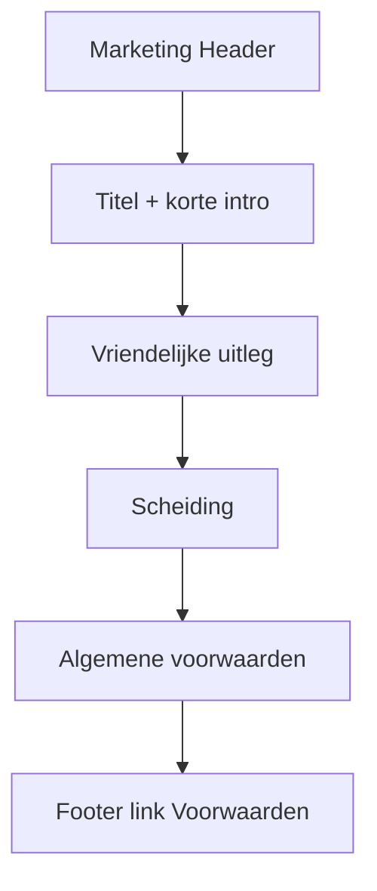

# Voorwaarden-pagina + registratie-akkoord

## Keuze

Zelfde patroon als [privacy](docs/plans/privacy-pagina.md):

1. Pagina **`/voorwaarden`** met twee blokken (vriendelijk boven, formeel onder met anker `#algemene-voorwaarden`)
2. Footer **Voorwaarden** → `/voorwaarden`
3. **Verplichte checkbox** op registratie, met server-side guard

Contact via `/contact` (zie [contact-pagina](docs/plans/contact-pagina.md)). Geen cookie-banner.

## Route en bestanden

```
src/app/(marketing)/voorwaarden/page.tsx
src/components/features/marketing/TermsPage.tsx
src/components/features/marketing/RegisterCard.tsx   # checkbox + body field
src/lib/auth/register.ts                             # acceptedTerms validatie
src/components/layout/Footer.tsx                     # href="/voorwaarden"
docs/plans/voorwaarden-pagina.md
```

- Route group `(marketing)` → bestaande `marketing-aura` achtergrond.
- Server Component; geen client state op de voorwaardenpagina.
- Thin page + metadata, zoals `privacy/page.tsx`.

## Layout / UX



- Hergebruik `Header`; content `main` met `max-w-3xl`, zelfde typografie-helpers als `PrivacyPage.tsx`.
- Metadata: `title: "Voorwaarden | Lumina"`.
- Cross-link naar `/privacy` waar relevant.

## Inhoud

**Deel 1 — vriendelijk (je-vorm):** wat Lumina is, wat je mag verwachten, AI als hulpmiddel (geen therapie/medisch advies), jouw verantwoordelijkheid bij gebruik, link naar `#algemene-voorwaarden`.

**Deel 2 — formeel:** toepasselijkheid; dienst (portfolio-/eindopdrachtproject, invite-only registratie); account; gebruiksregels; AI-disclaimer; IE (jouw content blijft van jou); beschikbaarheid; aansprakelijkheid (beperkt, realistisch voor dit project); beëindiging; privacy → `/privacy`; wijzigingen; contact → `/contact`. Datum “laatst bijgewerkt”.

Feitelijk houden — geen E2E-claim.

## Registratie-akkoord

In `RegisterCard.tsx`:

- State `acceptedTerms` (default `false`).
- Checkbox + label vóór de submit-knop met links naar `/voorwaarden` en `/privacy` (`target="_blank"`).
- Body naar API met `acceptedTerms: true`.

In `register.ts` + `api/auth/register/route.ts`:

- Als `acceptedTerms` niet strikt `true` → **400** `"Je moet akkoord gaan met de voorwaarden."`

Misleidende E2E-regel onder registratieformulier vervangen door accurate copy.

## Buiten scope

Disclaimer-pagina, cookie-banner, opslaan van akkoord-timestamp in de database.
